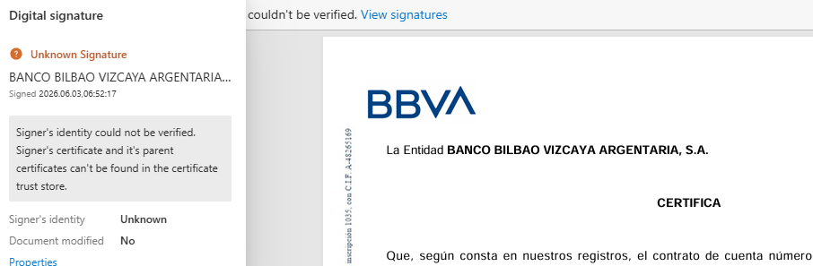

# Банковская выписка для ВНЖ цифрового кочевника в Испании

> Помощь в подаче документов на ВНЖ Испании: [ **t.me/ola_espana**](https://t.me/ola_espana)

Применимо для подачи на ВНЖ цифрового кочевника в Испании: и для работы <mark style="background-color: #dff1ff; color: inherit; white-space: nowrap;">в найме</mark>, и для работы <mark style="background-color: #dff1ff; color: inherit; white-space: nowrap;">по контракту</mark>.

## Требования к выписке

Подготовьте выписку за три месяца перед подачей. Поступления должны соответствовать инвойсам или зарплатным листам.

Банковская выписка должна быть заверена подписью или печатью банка на бумаге, квалифицированной электронной подписью или электронной печатью по правилам ЕС либо нотариально.

**Бумажная выписка.** Закажите выписку с собственноручной подписью сотрудника банка или мокрой печатью. Рекомендуем получить и подпись, и печать: в отдельных дозапросах UGE требует оба реквизита. Для подачи отсканируйте документ. Напечатанное изображение печати не является мокрой печатью.

**Электронная выписка с подписью.** Подходит выписка, заверенная квалифицированной электронной подписью или печатью банка по правилам ЕС. Подписанный PDF подавайте без изменений. Нужные строки выделяйте в отдельной копии.

*Пример выписки с электронной подписью. Проверке мешает отсутствие доверенного сертификата.*

**Электронная выписка.** Выписку из онлайн-банка без квалифицированной электронной подписи или печати по правилам ЕС заверьте у испанского нотариуса. Порядок действий описан ниже в разделе [«Нотариальное заверение выписки»](#нотариальное-заверение-выписки).

Выделите поступления от работодателя или клиентов.

Банковскую выписку не нужно переводить через jurado. Достаточно простого перевода на испанский.

Ранее одобряли и выписки без заверения. Подавать так - на свой риск: UGE может потребовать заверенную выписку.

## T-Банк, Payoneer, Deel

### T-Банк

Т-Банк позволяет заказать справку с движением средств за три месяца. Банк отдельно предупреждает: бумажная справка по стандартному заказу содержит напечатанную факсимильную печать; документ с мокрой печатью нужно запросить в поддержке. [Инструкция Т-Банка](https://www.tbank.ru/bank/help/debit-cards/tinkoff-black/get-statement/reference/).

В запросе на бумажный документ укажите оба реквизита: мокрая печать и собственноручная подпись сотрудника. Возможность заказать справку с мокрой печатью подтверждена банком; наличие на ней собственноручной подписи нужно согласовать отдельно.

### Payoneer, Deel и другие платформы

При получении оплаты через платформу:

1. Скачайте из личного кабинета выписку или отчет о поступлениях за три месяца перед подачей.
2. Приложите инвойсы, зарплатные листы или подтверждения выплат, связывающие поступления с клиентом или работодателем из контракта.
3. Если деньги переводились с платформы на банковский счет, приложите банковскую выписку с этими поступлениями.

Если в банковской выписке отправителем указана платформа, в сопроводительном письме поясните, от какого клиента или работодателя получены деньги, и сошлитесь на подтверждающий документ из платформы. Разницу в суммах из-за комиссии или конвертации также поясните.

Для электронной выписки платформы без заверения оформите нотариальный акт у испанского нотариуса. Он фиксирует вход в аккаунт и получение выписки из него. Порядок действий описан ниже в разделе [«Нотариальное заверение выписки»](#нотариальное-заверение-выписки).

## Нотариальное заверение выписки

На личном приеме попросите оформить нотариальный акт об удостоверении фактов (acta notarial de presencia).

Испанский нотариус не заверяет “правильность” банковских данных. Он фиксирует, что заявитель вошел в онлайн-банк или платежный сервис, показал аккаунт и скачал выписку.

Что должно попасть в акт:

- заявитель вошел в онлайн-банк или платежный сервис;
- аккаунт принадлежит заявителю;
- заявитель скачал выписку за нужный период;
- в выписке видны платежи от работодателя или клиентов;
- распечатка выписки или скриншоты приложены к акту.

Что сказать нотариусу на приеме:

> Мне нужно подтвердить выписку из онлайн-банка или платежного сервиса для подачи на ВНЖ в Испании. Я войду в свой аккаунт и скачаю выписку в вашем присутствии. Прошу зафиксировать в нотариальном акте, что аккаунт принадлежит мне и выписка получена из него, и приложить выписку к акту.

При записи назовите банк или платформу и язык интерфейса. Если интерфейс не на испанском, уточните, нужен ли переводчик на приеме.

Если акт делает испанский нотариус для подачи в Испании, апостиль на такой акт не нужен.

[Юридическая сила электронной подписи и печати](https://digital-strategy.ec.europa.eu/en/faqs/questions-answers-trust-services-under-european-digital-identity-regulation).

[Как проверить электронную подпись в Adobe Acrobat](https://helpx.adobe.com/acrobat/desktop/e-sign-documents/manage-digital-signatures/validate-digital-sign.html).

[Документы для первичной подачи: перечень UGE, стр. 3](https://www.inclusion.gob.es/documents/d/unidadgrandesempresas/informacion-documentacion-pagina-web-titular-v2).

<!-- PUBLIC_CONTENT_END -->

---

# Служебная часть: не публиковать

Все ниже этой отсечки хранится только в Markdown и не переносится на сайт, в том числе в HTML-комментарии.

Статус: подготовлено к публикации 08.09.2026. Для сайта используется только текст до отсечки. Вопросы для дальнейшей проверки и рабочие материалы остаются ниже.

## Что требует уточнения

### Достаточно ли выписки платформы без банковской выписки?

В [официальном перечне UGE, стр. 3](https://www.inclusion.gob.es/documents/d/unidadgrandesempresas/informacion-documentacion-pagina-web-titular-v2) указан банковский сертификат. Отдельного правила о его замене выпиской платежной платформы не найдено. Участники чата описывают подачу нотариально оформленной выписки Payoneer, но это не подтверждает достаточность документов любой платформы. Требование специально вывести деньги в банк также не найдено. Поэтому инструкция описывает фактические поступления и переводы, не обещая, что одной выписки платформы будет достаточно.

### Подпись и мокрая печать обязательны во всех случаях?

В [официальном перечне UGE, стр. 3](https://www.inclusion.gob.es/documents/d/unidadgrandesempresas/informacion-documentacion-pagina-web-titular-v2) написано `sellado/firmado por la entidad bancaria`. Слово "мокрая" отсутствует. В [пересказе конференции 24 июля 2026 года](https://ola-espanola.github.io/docs/uge-conference-update.html) перечислены альтернативы: подпись **или** мокрая печать **или** нотариальное заверение. Именно эта формулировка использована в основном разделе. Пересказ не является официальным протоколом UGE.

Подпись **и** печать одновременно требовались в конкретных делах, тексты которых опубликованы в чате. Поэтому получить оба реквизита рекомендуем, но не называем это общим обязательным требованием. Критерии, по которым UGE требует оба реквизита или нотариальное заверение онлайн-выписки, в общем перечне не раскрыты.

### Какое электронное заверение выдает конкретный банк?

Квалифицированная электронная подпись по правилам ЕС юридически равнозначна собственноручной. Квалифицированная электронная печать подтверждает происхождение и целостность документа. Основание: статьи 25 и 35 [регламента eIDAS](https://www.boe.es/buscar/doc.php?id=DOUE-L-2014-81822).

Но сам факт, что банк находится в ЕС, не означает, что его PDF заверен такой подписью или печатью. QR-код и изображение печати этого не подтверждают. Нужно установить вид подписи и выдавший сертификат удостоверяющий центр.

Для рекомендаций по конкретным банкам нужно проверить, какие подписи или печати они используют в выдаваемых выписках и являются ли они квалифицированными по правилам ЕС. По одному успешному случаю подачи тип подписи установить нельзя.

Российская ЭЦП автоматически не получает статус квалифицированной подписи ЕС: признание услуг из третьих стран регулирует статья 14 eIDAS в [редакции 2024 года](https://www.boe.es/buscar/doc.php?id=DOUE-L-2024-80608). Подтверждения приема российских банковских ЭЦП и порядка их проверки UGE не найдено.

### Нотариус обязательно должен быть испанским?

В найденных текстах требований к онлайн-выпискам страна нотариуса не указана. В инструкции описан вариант с испанским нотариусом, подтвержденный практикой участников чата. Оснований объявлять его единственным допустимым вариантом нет. Условия заверения вне Испании требуют отдельной проверки.

### Как оформить единый банковский сертификат?

Возможность приложить один сертификат к нескольким выпискам одного владельца по одному счету указана в пересказе LM Lawyers Valencia о встрече 24 июля. Этот вариант отложен и в публикуемую часть не включен. Саму встречу подтверждает [анонс организатора RIA Eureka](https://es.linkedin.com/posts/ria-eureka_invitaci%C3%B3n-charla-red-eureka-activity-7475050076416126978-Yr5p), но запись или официальный протокол с этим правилом не найдены. Точный текст сертификата и порядок привязки к нему выписок требуют уточнения: в пересказе они не описаны.

## Контакты нотариусов

### Мадрид: Notaría Miriam Herrando Deprit

- Адрес: Calle del Príncipe de Vergara, 84, 1, 28006 Madrid.
- Телефон: +34 915 64 17 35.
- Электронная почта: despacho@principedevergara84.com.
- [Карточка конторы с адресом, телефоном и доменом](https://es.cybo.com/ES-biz/notar%C3%ADa-miriam-herrando-deprit).

В сообщении от 09.06.2026 участница указала эту почту и сообщила о заверении справки Revolut за 144 евро. Источник: `Закрытый_чат_Продление_2026-09-06/messages6.html#message7267` в полной базе Telegram.

Адрес и телефон сверены со справочником 08.09.2026. Актуальность почты и текущую цену непосредственно у конторы не подтверждали.

### Барселона: Notaría Jesús Gómez Taboada

- Адрес: Av. Diagonal 376, 1-C, 08037 Barcelona.
- Телефон: +34 938 57 48 48.
- Электронная почта: info@notariajgt.com.
- [Сайт нотариальной конторы: услуги и контакты](https://notariagomeztaboada.com/es/actas/).

Контакты сверены с сайтом конторы 08.09.2026. В Telegram контору рекомендовали для регистрации партнерства, а не заверения выписок: сообщение от 12.05.2026, `Чат_ВНЖ_Digital_Nomad_2026-09-06/messages184.html#message268686`.

Заверение банковских выписок в этой конторе требует подтверждения. В сообщении о цене в Барселоне от 02.06.2026 назван только "Хесус" без фамилии; приписывать цену 350-360 евро этой конторе оснований недостаточно.

## Внутренние источники

По сообщениям в чате за 2026 год, ориентир по стоимости - 80-360 евро. В Барселоне встречались предложения за 350-360 евро. Итоговая сумма может меняться в зависимости от объема выписки, приложений и копий; уточните ее при записи.

Источники для внутренней проверки:

- `02-bankovskaya-vypiska-requirements-research.md`: результаты проверки первоисточников, электронных подписей и конференций на 08.09.2026.
- `02-bankovskaya-vypiska-notary-research.md`: проверка порядка нотариального заверения, цен и контактов по полной базе Telegram на 08.09.2026. Диапазон включает сообщения о выполненном заверении и предложения цены.
- `content/uge-conference-update.md` и `Doc/Конференция UGE.txt`: пересказ конференции. Формула "подпись или печать или нотариус" и один сертификат на несколько выписок не подтверждены как универсальное правило официальным протоколом.
- `Doc/Telegram/topics/bank_insurance.md`, сообщение 2026-08-12T16:58:46: текст дозапроса UGE по банковскому сертификату, печати/подписи, онлайн-банку и выделению платежей.
- `Doc/Telegram/topics/digital_tools.md`, сообщение 2026-08-12T16:58:46: тот же текст дозапроса UGE: для онлайн-банка требуется нотариализация.
- `Doc/Telegram/topics/digital_tools.md`, сообщение 2026-07-10T08:57:06: текст решения об оставлении первичного заявления без дальнейшего рассмотрения, цитирующий требование от 22.06.2026. По банковскому сертификату указаны подпись ответственного лица И печать, для онлайн-банка нотариальное заверение. Не смешивать с отдельным требованием к оплате tasa, где стоит ИЛИ.
- `Doc/Telegram/topics/digital_tools.md`, сообщение 2026-06-02T21:32:12: опыт с электронной выпиской T-Банка без мокрой печати и нотариуса.
- `Doc/Telegram/topics/digital_tools.md`, сообщение 2026-04-28T18:18:57, `Закрытый_чат_Продление_2026-09-06/messages5.html#message5534`: успешное продление с электронной выпиской BBVA. По словам автора, ЭЦП была нарушена редактированием PDF; случай не доказывает проверку ЭЦП со стороны UGE.
- `Doc/Telegram/topics/bank_insurance.md`, сообщение 2026-09-03T23:00: опыт заверения выписки Payoneer у нотариуса в Испании.
- `Doc/Telegram/topics/bank_insurance.md`, сообщение 2026-09-01T22:20: опыт нотариального заверения выписки Revolut.
- Полная база Telegram, сообщение 2026-04-14T10:11:03, `Чат_ВНЖ_Digital_Nomad_2026-09-06/messages182.html#message265414`: опыт нотариального заверения Revolut за 80 евро; повтор от 06.05.2026 в `Закрытый_чат_Продление_2026-09-06/messages5.html#message5790` относится к той же услуге.
- `Doc/Telegram/topics/digital_tools.md`, сообщение 2026-04-23T15:22:56: по ИП-счету электронная подпись банка не подошла, приняли бумажную выписку; по счету физлица электронная подпись проходила.
- `Doc/Telegram/topics/digital_tools.md`, сообщение 2026-04-21T13:03:53: дозапрос на банковскую выписку по ИП-счету с печатью и подписью; квадратная электронная печать Альфа-Банка не устроила.
- `Doc/Telegram/topics/bank_insurance.md`, сообщение 2026-08-07T16:00: риск выписок без живой печати, особенно у необанков.

Официальные источники для публичной версии:

- [Генеральный совет нотариата Испании: виды нотариальных актов](https://www.notariado.org/portal/es/actas-notariales) - назначение акта об удостоверении фактов, лично установленных нотариусом.
- [Payoneer: получение выписок и истории операций](https://payoneer.custhelp.com/app/answers/detail/a_id/27046/kw/statement) - выгрузка истории операций и ежемесячных выписок.
- [Deel: выписки и история операций в кошельке](https://help.letsdeel.com/hc/en-gb/articles/26554806456593-How-to-Use-Deel-Wallet) - получение ежемесячных выписок и истории операций; наличие документов зависит от используемого продукта платформы.
- [Раздел UGE о требованиях и документации](https://ciudadaniaexterior.inclusion.gob.es/es/web/unidadgrandesempresas/autorizaciones-y-requisitos) - официальный раздел с Ley 14/2013 и ориентировочной документацией.
- [Раздел UGE о teletrabajadores](https://www.inclusion.gob.es/uk/web/unidadgrandesempresas/teletrabajadores) - краткое описание teletrabajador de caracter internacional и ссылки на документацию.
- [Т-Банк о переименовании и действительности справок](https://www.tbank.ru/finance/blog/goes-tbank/) - пояснение банка о названии в справках и выписках.
