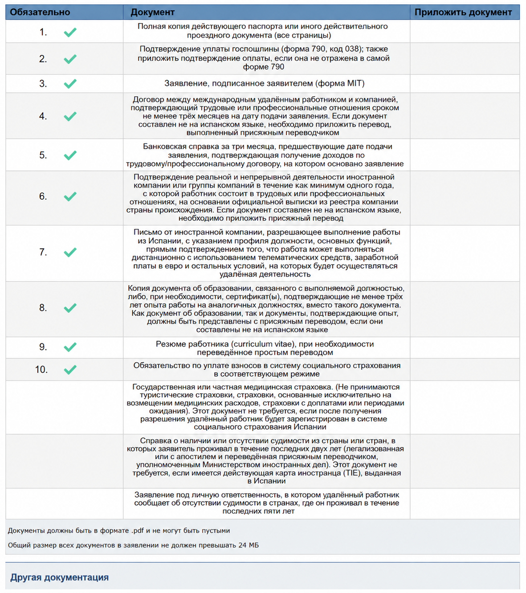
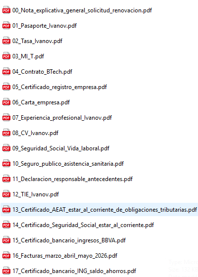

# Первичная подача: работа по контракту

> Вопросы по подаче можно задать в Telegram: [t.me/ola_espana](https://t.me/ola_espana).

Вариант для заявителя из России, который не работает в штате иностранной компании, а оказывает услуги иностранным компаниям-клиентам по договорам. После одобрения заявитель регистрируется в Испании как работающий на себя: по-испански это autonomo.

## Список документов

| Документ | Что подтверждает | Перевод [jurado](../docs/document-requirements.html#jurado-perevod) / легализация |
|---|---|---|
| Сопроводительное письмо | Объясняет состав пакета и формат работы по контракту | Нет, лучше сразу на испанском |
| Formulario MIT | Само заявление | Нет |
| Паспорт | Личность и срок действия документа | Обычно нет |
| Tasa 790 038 | Оплату госпошлины | Нет |
| Договоры с клиентами | Профессиональные отношения минимум 3 месяца до подачи | Если не на испанском - [jurado](../docs/document-requirements.html#jurado-perevod) |
| Инвойсы или акты | Что работа реально выполняется и по ней есть доход | Если не на испанском - обычно [jurado](../docs/document-requirements.html#jurado-perevod) |
| Банковская выписка за 3 месяца | Поступление дохода на счет заявителя | Если документ не на испанском - [jurado](../docs/document-requirements.html#jurado-perevod) |
| Документы компании-клиента | Компания-клиент существует и ведет деятельность минимум 1 год | Публичный иностранный документ: апостиль/легализация + [jurado](../docs/document-requirements.html#jurado-perevod) |
| Письмо компании-клиента | Удаленный формат, услуги, сроки, суммы и возможность работать из Испании | Если не на испанском - [jurado](../docs/document-requirements.html#jurado-perevod) |
| Диплом или опыт | Квалификация: профильное образование или минимум 3 года опыта | Для публичных документов - апостиль/легализация + [jurado](../docs/document-requirements.html#jurado-perevod); письма компаний переводить [jurado](../docs/document-requirements.html#jurado-perevod) |
| CV | Профиль заявителя | Достаточно простого перевода, если не на испанском |
| Обязательство зарегистрироваться как autonomo | Что после одобрения заявитель встанет на учет в Испании и будет платить взносы | Нет, лучше сразу на испанском |
| Несудимость | Отсутствие судимости за последние 2 года | Апостиль/легализация + [jurado](../docs/document-requirements.html#jurado-perevod) |
| Declaracion responsable | Заявление об отсутствии судимости за последние 5 лет | Нет, лучше сразу на испанском |
| Легальное нахождение в Испании | Право подать заявление из Испании | Обычно нет, зависит от документа |
| Представитель | Право представителя подавать и подписывать документы | Если иностранный документ - по ситуации jurado/легализация |

## Пример состава пакета для подачи

Номера файлов повторяют строки оригинальной формы. Остальное прикладывается в раздел дополнительных документов, если относится к вашему случаю.

1. `01_Pasaporte.pdf` - полный паспорт, все страницы.
2. `02_Tasa_790_038.pdf` - форма 790, код 038, и подтверждение оплаты, если оплата не видна на самой форме.
3. `03_Formulario_MIT.pdf` - заявление MIT, заполненное и подписанное заявителем.
4. `04_Contratos_clientes.pdf` - договоры с иностранными клиентами, подтверждающие связь минимум 3 месяца до подачи.
5. `05_Extracto_bancario_ultimos_3_meses.pdf` - банковская справка или выписка за 3 месяца, где видны поступления по договорам.
6. `06_Documentos_clientes.pdf` - подтверждение, что клиенты или компании реально существуют и ведут деятельность минимум 1 год.
7. `07_Cartas_clientes.pdf` - письма от клиентов с описанием услуг, удаленного формата, сроков, сумм и возможности работать из Испании.
8. `08_Titulo_o_experiencia.pdf` - диплом либо подтверждение минимум 3 лет релевантного опыта.
9. `09_CV.pdf` - резюме заявителя.
10. `10_Compromiso_cotizacion_autonomo.pdf` - обязательство платить взносы в испанскую систему социального страхования как autonomo.
12. `12_Certificado_antecedentes_penales.pdf` - справка о несудимости за страны проживания за последние 2 года, если применимо.
13. `13_Declaracion_responsable_antecedentes.pdf` - декларация заявителя об отсутствии судимости за последние 5 лет.

### Дополнительные документы

- `Carta_explicativa.pdf` - сопроводительное письмо: кто заявитель, какие клиенты, какая работа, как устроен доход.
- `Facturas_o_actas_ultimos_3_meses.pdf` - инвойсы, акты или аналогичные документы за последние 3 месяца.
- `Estancia_regular_en_Espana.pdf` - подтверждение легального нахождения в Испании: виза, штамп въезда, декларация о въезде, TIE или другой подходящий документ.
- `Representacion.pdf` - документы представителя, если подает представитель.

## Что важно именно здесь

Работа по контракту должна выглядеть как реальная профессиональная деятельность, а не как разовый заказ без истории. В пакете должны сходиться договоры, инвойсы или акты, банковские поступления и письма клиентов.

После одобрения заявитель регистрируется в Испании как autonomo и платит взносы. Если этого не сделать, это может стать основанием для прекращения ВНЖ.

Если заявитель работает только со своей компанией или сам фактически контролирует компанию-клиента, пакет сложнее: UGE может запросить документы о собственности, налогах компании, реальной деятельности, вложениях и сотрудниках. Для первичной подачи понятнее выглядит пакет с независимыми внешними клиентами.

## Пример подготовки файлов

Ниже примеры из рабочей папки по подаче. Они не заменяют список выше: в форме часть документов может уходить в дополнительные поля, а набор файлов зависит от конкретного кейса.

_Оригинал формы подачи со списком обязательных документов._

## Официальные ссылки

Закон, памятка UGE, страница подачи и другие официальные ресурсы собраны на странице [Полезные ссылки](../docs/links.html).
