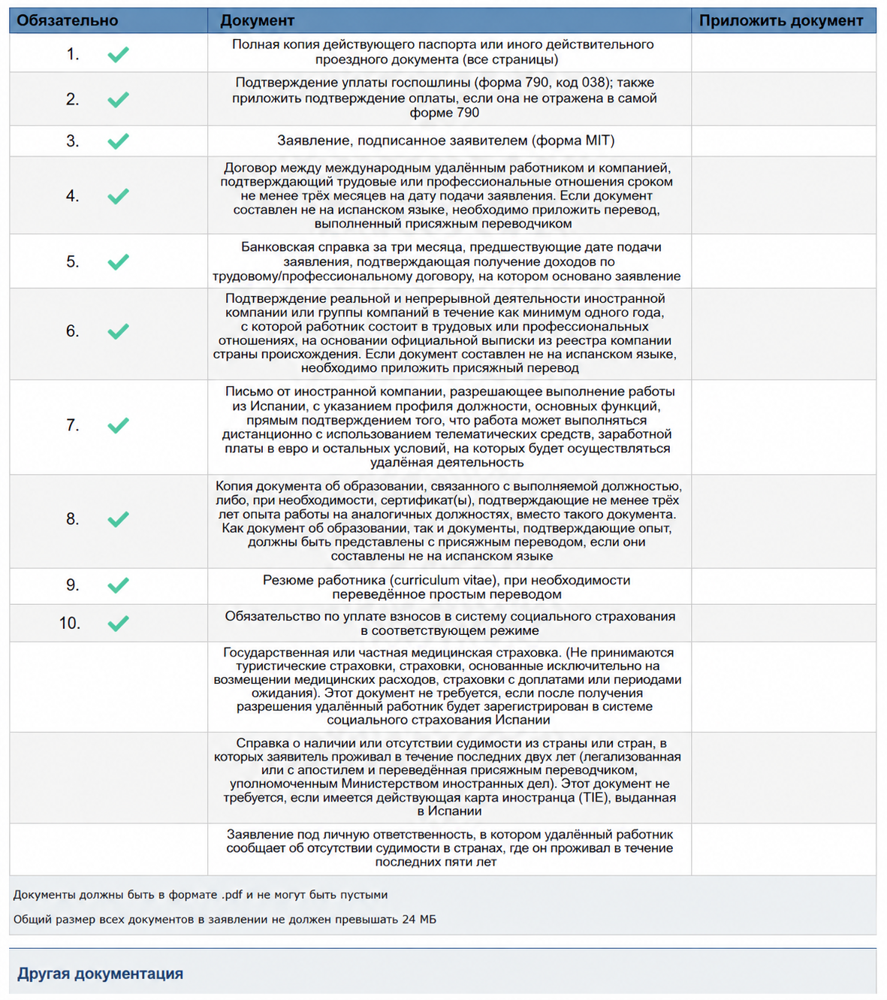

# Полный список документов для визы и ВНЖ цифрового кочевника в Испании для тех, кто работает по контракту

> Помощь в подаче документов на ВНЖ Испании: [ **t.me/ola_espana**](https://t.me/ola_espana)

Полный список документов для визы и ВНЖ цифрового кочевника в Испании для заявителя из России, который оказывает услуги компаниям-клиентам по договорам. После одобрения заявитель регистрируется в Испании как работающий на себя — autónomo.

Если вы работаете в найме по трудовому договору, см. [документы для тех, кто работает в найме](../docs/cuenta-ajena.html).

## Список документов

Ниже — основной список документов для подачи на визу или ВНЖ цифрового кочевника для тех, кто работает по контракту. [Присяжный перевод](../docs/sworn-translation.html) (traducción jurada, также называют хурадо-переводом) — официальный перевод на испанский, выполненный присяжным переводчиком.

- **Паспорт.** Полная копия действующего загранпаспорта — все страницы, включая пустые.
- **Госпошлина Tasa 790 038.** Форма государственной пошлины по заявлению и подтверждение оплаты.
- **Заявление MIT.** Официальная форма Formulario MIT, заполненная и подписанная заявителем или представителем. См. [Formulario MIT](../docs/formulario-mit.html).
- **Контракты с клиентами.** Подтверждают профессиональные отношения минимум за 3 месяца до подачи. Из договоров должно быть понятно, какие услуги оказывает заявитель, на каких условиях и за какое вознаграждение. См. [Требования к контракту](../docs/client-contracts.html).
- **Банковская выписка за последние 3 месяца.** Показывает фактическое поступление дохода по договорам. Поступления должны сопоставляться с инвойсами за тот же период. Если доход по договорам ниже требуемого минимума, разницу можно подтверждать ликвидными средствами на банковских счетах. См. [Банковская выписка](../docs/bank-statement.html).
- **Документы о регистрации клиентов.** Подтверждают, что компании-клиенты реально существуют и ведут деятельность не менее 1 года. Для российского юридического лица используется выписка из ЕГРЮЛ, для ИП — выписка из ЕГРИП; для иностранных компаний — соответствующий официальный реестровый документ. См. [Документы компании](../docs/company-registration.html).
- **Письма от клиентов.** Клиенты подтверждают характер услуг, удалённый формат работы, сроки сотрудничества, суммы и возможность выполнять работу из Испании. См. [Письмо компании](../docs/client-letter.html).
- **Диплом или подтверждение профессионального опыта.** Профильное образование либо не менее 3 лет релевантного профессионального опыта. См. [Апостиль диплома](../docs/diploma-apostille.html), [Выписка из трудовой](../docs/electronic-work-record.html) и [присяжный перевод](../docs/sworn-translation.html).
- **[Резюме (CV)](../docs/cv.html) на испанском.** Краткое резюме с образованием, профессиональным опытом, текущей деятельностью и навыками.
- **Обязательство зарегистрироваться как autónomo** (<a href="../assets/files/Declaracion_compromiso_alta_Seguridad_Social.docx" download>скачать</a>). Заявитель обязуется после одобрения зарегистрироваться в испанской системе социального страхования как работающий на себя и платить соответствующие взносы.
- **[Справка о несудимости](../docs/criminal-record-certificate.html).** При первичной подаче подтверждает отсутствие судимости в странах проживания за последние 2 года, если не действует исключение UGE.
- **Декларация об отсутствии судимости за последние 5 лет** (<a href="../assets/files/Declaracion_responsable_antecedentes_penales.pdf" download>скачать</a>). Отдельная декларация заявителя на испанском языке.
- **Инвойсы (facturas) за последние 3 месяца.** Подтверждают доход по профессиональным договорам. Суммы и даты должны сопоставляться с поступлениями в банковской выписке. Акты или аналогичные документы можно приложить дополнительно.
- **[Подтверждение легального нахождения в Испании](../docs/legal-stay-in-spain.html).** Нужно при подаче на ВНЖ из Испании.
- **Сопроводительное письмо.** Коротко объясняет, кто заявитель, с какими клиентами он работает, какие услуги оказывает, как устроен доход и как документы в пакете связаны между собой.
- **Документ о назначении представителя — если подаёт представитель.** Designación de representante подтверждает полномочия представителя.

## Пример состава пакета для подачи

Пример названий файлов для тех, кто работает по контракту. Номера повторяют строки формы UGE; остальные документы загружаются в раздел дополнительных документов.

1. `01_Pasaporte.pdf` — полный загранпаспорт, все страницы.
2. `02_Tasa_790_038.pdf` — госпошлина Tasa 790 038 и подтверждение оплаты.
3. `03_Formulario_MIT.pdf` — заполненное и подписанное заявление MIT.
4. `04_Contratos_clientes.pdf` — контракты с клиентами, подтверждающие отношения минимум 3 месяца до подачи.
5. `05_Extracto_bancario_ultimos_3_meses.pdf` — банковская выписка или справка за последние 3 месяца с поступлениями по договорам.
6. `06_Documentos_clientes.pdf` — документы о регистрации клиентов и их деятельности минимум 1 год.
7. `07_Cartas_clientes.pdf` — письма клиентов с описанием услуг, удалённого формата, сроков, сумм и возможности работать из Испании.
8. `08_Titulo_o_experiencia.pdf` — диплом либо документы, подтверждающие минимум 3 года релевантного опыта.
9. `09_CV.pdf` — резюме заявителя на испанском.
10. `10_Compromiso_cotizacion_autonomo.pdf` — обязательство зарегистрироваться как autónomo и платить взносы в испанскую систему социального страхования.
12. `12_Certificado_antecedentes_penales.pdf` — справка о несудимости, если она требуется.
13. `13_Declaracion_responsable_antecedentes.pdf` — декларация об отсутствии судимости за последние 5 лет.

### Дополнительные документы

- `Carta_explicativa.pdf` — сопроводительное письмо.
- `Facturas_ultimos_3_meses.pdf` — инвойсы за последние 3 месяца; при необходимости вместе с актами или аналогичными документами.
- `Estancia_regular_en_Espana.pdf` — загранпаспорт с доказательством въезда или легального пребывания либо TIE.
- `Representacion.pdf` — документ о назначении представителя, если заявление подаёт представитель.

## Что важно для тех, кто работает по контракту

Пакет должен показывать реальную профессиональную деятельность, а не разовый заказ без истории. Контракты, инвойсы, банковские поступления и письма клиентов должны согласовываться между собой.

После одобрения заявитель регистрируется в Испании как autónomo и платит взносы в испанскую систему социального страхования.

Если заявитель является собственником компании-клиента или фактически контролирует её, по памятке UGE дополнительно подаются документы, подтверждающие собственность или контроль, последняя декларация компании по налогу на прибыль, сведения об инвестициях компании в производственные активы и история сотрудников по системе социального страхования.

## Раздел с файлами в форме подачи

Основные документы загружаются в свои поля электронной формы UGE, а документы без отдельного поля — в раздел «Другие документы».

_Раздел с файлами в форме подачи для тех, кто работает по контракту._

## Официальные ссылки

Закон, памятка UGE, страница подачи и другие официальные ресурсы собраны на странице [Полезные ссылки](../docs/links.html).

## Полный список документов для визы и ВНЖ цифрового кочевника в Испании для тех, кто работает по контракту

На этой странице представлен **полный список документов для визы и ВНЖ цифрового кочевника в Испании для тех, кто работает по контракту**: заявление MIT, договоры с клиентами, банковские поступления, документы компаний, письма клиентов, подтверждение квалификации, обязательство зарегистрироваться как autónomo и документы об отсутствии судимости.
