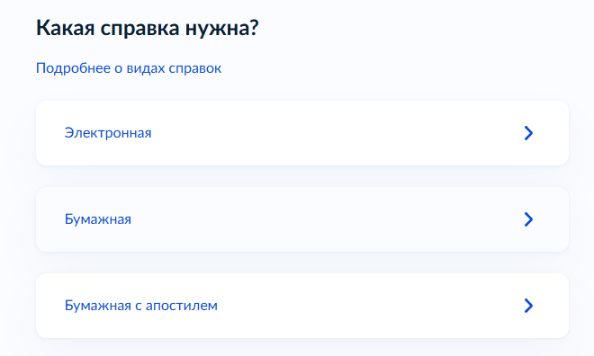

# Справка о несудимости для ВНЖ цифрового кочевника в Испании

> Помощь в подаче документов на ВНЖ Испании: [ **t.me/ola_espana**](https://t.me/ola_espana)

Применимо для первичной подачи на ВНЖ цифрового кочевника в Испании <mark style="background-color: #dff1ff; color: inherit; white-space: nowrap;">по контракту</mark> или <mark style="background-color: #dff1ff; color: inherit; white-space: nowrap;">по найму</mark>.

## Что требует UGE

Нужна справка о несудимости из страны или стран, где заявитель проживал последние 2 года. Декларация об отсутствии судимости за последние 5 лет подается отдельно и не заменяет справку.

Если заявитель уже имеет испанскую резиденцию или разрешение на пребывание сроком более 6 месяцев и ранее подавал справку для получения этого разрешения, новую справку UGE не требует.

## Какую справку получать в России

Официальное название документа: «Справка о наличии (отсутствии) судимости и (или) факта уголовного преследования либо о прекращении уголовного преследования».

Для подачи нужен комплект:

1. Бумажная справка МВД.
2. Апостиль МВД на справке.
3. `jurado` перевод справки и апостиля на испанский.

Электронный PDF с Госуслуг без апостиля не подходит.

## Как заказать на Госуслугах

1. Откройте услугу [«Справка об отсутствии судимости»](https://www.gosuslugi.ru/600103/1/form).
2. На экране «Какая справка нужна?» выберите **«Бумажная с апостилем»**.

<figure style="max-width: 555px; margin: 24px 0;">
  
  <figcaption>Выберите «Бумажная с апостилем».</figcaption>
</figure>

3. В заявлении укажите страну назначения: Испания. Закажите выдачу бумажного оригинала с апостилем, а не электронный PDF и не бумажную справку без апостиля.
4. После получения передайте справку и апостиль присяжному переводчику.

Граждане России могут также оформить справку в консульстве России в Испании.

## Получение через представителя

При выдаче в Москве на ул. Велозаводская, 6А справку может получить представитель по доверенности. Принимают как простую рукописную, так и нотариальную доверенность; отдельные сотрудники требуют оригинал нотариальной доверенности.

## Если проживали в другой стране

Нужна отдельная справка из каждой страны проживания за последние 2 года. Для каждой справки проверьте способ легализации: апостиль или консульская легализация. Затем сделайте `jurado` перевод на испанский.

Если справка подается не из страны гражданства, приложите документ, подтверждающий проживание в этой стране: ВНЖ, регистрацию или другой официальный документ.

<!-- PUBLIC_CONTENT_END -->

---

# Служебная часть: не публиковать

Все ниже этой отсечки хранится только в Markdown и не переносится на сайт, в том числе в HTML-комментарии.

Статус: 10 сентября 2026 года подготовлен локальный чистовик. Публичная часть синхронизирована с `docs/criminal-record-certificate.html`. Отправка в GitHub не выполнялась.

## Официальные источники

- [Инструкция UGE для основного заявителя](https://ucraniaurgente.inclusion.gob.es/documents/d/unidadgrandesempresas/informacion-documentacion-pagina-web-titular-v2), страницы 5-6: справка нужна из страны или стран проживания за последние 2 года; отдельная декларация об отсутствии судимости охватывает 5 лет; иностранные публичные документы должны быть легализованы или апостилированы и переведены присяжным переводчиком.
- [Закон 14/2013, статья 62.3.c](https://www.boe.es/buscar/act.php?id=BOE-A-2013-10074#a62): отсутствие судимости в Испании и в странах проживания за последние 2 года; отдельная декларация за 5 лет. Статья 62.4 распространяет эти требования на членов семьи.
- [Госуслуги: получить справку о наличии или отсутствии судимости](https://www.gosuslugi.ru/600103/1/form). 10 сентября 2026 года живая форма была проверена без отправки заявления. На первом экране «Какая справка нужна?» доступны варианты «Электронная», «Бумажная» и «Бумажная с апостилем».
- [Инструкция МИД России по заявлению на справку](https://russianembassyza.mid.ru/upload/iblock/dd1/uoq2q09ggq6xyyuvn9cnn3y7ipmr0d37.pdf): заявление можно подать в российском дипломатическом представительстве или консульском учреждении. Указанная во внешнем материале страница генконсульства в Барселоне сейчас возвращает 404.

## Что подтверждает база Telegram

1. Бумажную справку с апостилем заказывают через Госуслуги: `Чат_ВНЖ_Digital_Nomad_2026-09-06/messages193.html#message282902`.
2. При выдаче на Велозаводской, 6А есть получение по рукописной доверенности, но есть и сообщения о требовании оригинала нотариальной доверенности: `Чат_ВНЖ_Digital_Nomad_2026-09-06/messages99.html#message116123`, `Чат_ВНЖ_Digital_Nomad_2026-09-06/messages90.html#message105342`.
3. После дозапроса заявителю без проживания в России запросили российскую справку; он повторно приложил эстонскую справку и получил одобрение: `Digital_nomad_Испания_2026-09-06/messages26.html#message57311`. Это не меняет правило UGE о странах проживания, но подтверждает риск дозапроса и пользу доказательств проживания в другой стране.
4. В чате называют срок 6 месяцев, однако другое сообщение говорит о дозапросе справки трехмесячной давности: `Чат_ВНЖ_Digital_Nomad_2026-09-06/messages194.html#message283794`, `Закрытый_чат_Продление_2026-09-06/messages3.html#message4017`. Срок не публиковать как установленное правило без официального источника.

## Что требует уточнения

1. **Срок давности справки.** В опубликованной инструкции UGE и статье 62 срока нет. Не писать в публичном тексте «справка действует 6 месяцев».
2. **Порог проживания в другой стране.** Некоторые сообщения называют 6 месяцев, но UGE использует формулировку «страна или страны проживания» без численного порога.
3. **Справка уже выдана без апостиля.** В базе не найден подтвержденный алгоритм: куда и с каким заявлением обращаться за апостилем после выдачи справки. Не направлять заявителя «просто в МВД» без проверки процедуры.
