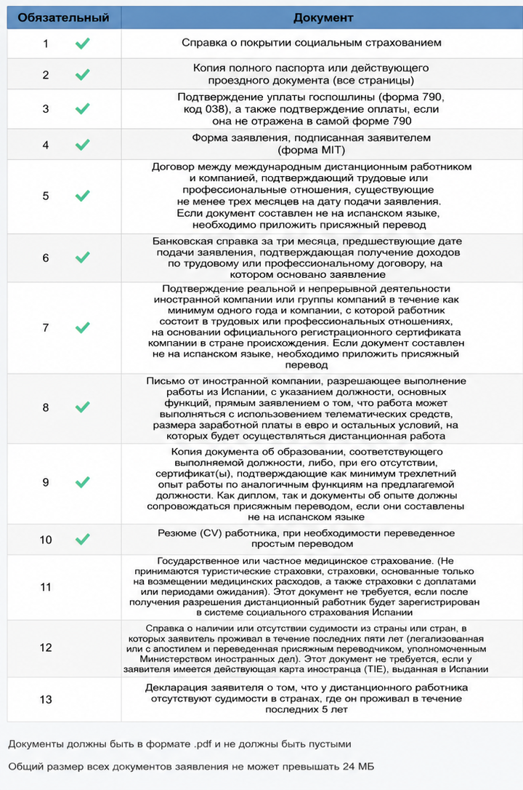
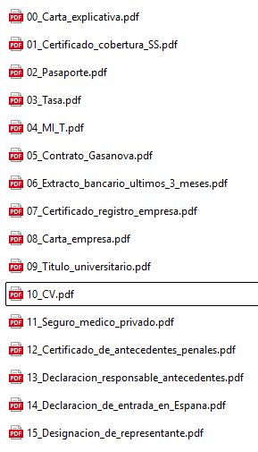

# Первичная подача: работа в найме

> Вопросы по подаче можно задать в Telegram: [t.me/ola_espana](https://t.me/ola_espana).

Вариант для заявителя из России, который работает дистанционно из Испании по трудовому договору на иностранную компанию или группу компаний, расположенную вне Испании. В испанских источниках это проходит как `teletrabajador internacional por cuenta ajena`.

## Список документов

| Документ | Что подтверждает | Перевод [jurado](../docs/document-requirements.html#jurado-perevod) / легализация |
|---|---|---|
| Сопроводительное письмо | Объясняет состав пакета и нестандартные места загрузки | Нет, лучше сразу на испанском |
| Formulario MIT | Само заявление | Нет |
| Паспорт | Личность и срок действия документа | Обычно нет |
| Tasa 790 038 | Оплату госпошлины | Нет |
| Трудовой договор | Трудовые отношения минимум 3 месяца | Если не на испанском - [jurado](../docs/document-requirements.html#jurado-perevod) |
| Зарплатные листы | Фактический доход по трудовому договору | Нет |
| Банковская выписка за 3 месяца | Поступление дохода на счет заявителя | Нет |
| Регистрация компании | Компания существует и работает минимум 1 год | Публичный иностранный документ: апостиль/легализация + [jurado](../docs/document-requirements.html#jurado-perevod) |
| Письмо компании | Разрешение работать из Испании, должность, функции, удаленный формат, зарплата в евро, условия | Нет |
| Диплом или опыт | Квалификация: профильное образование или минимум 3 года опыта | Для публичных документов - апостиль/легализация + [jurado](../docs/document-requirements.html#jurado-perevod); письма компаний переводить [jurado](../docs/document-requirements.html#jurado-perevod) |
| CV | Профиль заявителя | Достаточно простого перевода, если не на испанском |
| Сертификат покрытия Seguridad Social | Какая система соцзащиты будет применяться | Иностранные публичные сертификаты: апостиль/легализация + [jurado](../docs/document-requirements.html#jurado-perevod) |
| Медицинская страховка | Медицинское покрытие в Испании | Нет |
| Несудимость | Отсутствие судимости за последние 2 года | Апостиль/легализация + [jurado](../docs/document-requirements.html#jurado-perevod) |
| Declaracion responsable | Заявление об отсутствии судимости за последние 5 лет | Нет, лучше сразу на испанском |
| Легальное нахождение в Испании | Право подать заявление из Испании | Обычно нет, зависит от документа |
| Представитель | Право представителя подавать и подписывать документы | Если иностранный документ - по ситуации jurado/легализация |

## Пример состава пакета для подачи

Файлы с номерами 01-13 идут в порядке полей формы. Остальные документы загружаются в раздел дополнительных документов.

1. `01_Certificado_cobertura_Seguridad_Social.pdf` - сертификат покрытия социальным страхованием.
2. `02_Pasaporte.pdf` - полный паспорт, все страницы.
3. `03_Tasa_790_038.pdf` - форма 790, код 038, и подтверждение оплаты, если оплата не видна на самой форме.
4. `04_Formulario_MIT.pdf` - заявление MIT, заполненное и подписанное заявителем.
5. `05_Contrato_laboral.pdf` - трудовой договор с иностранной компанией, подтверждающий связь минимум 3 месяца до подачи.
6. `06_Certificado_bancario_ultimos_3_meses.pdf` - банковский сертификат за 3 месяца с поступлениями дохода по договору.
7. `07_Certificado_registro_empresa.pdf` - подтверждение, что иностранная компания реально существует и ведет деятельность минимум 1 год.
8. `08_Carta_empresa.pdf` - письмо от компании с разрешением работать удаленно из Испании.
9. `09_Titulo_o_experiencia.pdf` - диплом либо подтверждение минимум 3 лет релевантного опыта.
10. `10_CV.pdf` - резюме заявителя.
11. `11_Seguro_medico.pdf` - медицинская страховка, оформленная в Испании.
12. `12_Certificado_antecedentes_penales.pdf` - справка о несудимости за страны проживания за последние 2 года, если применимо.
13. `13_Declaracion_responsable_antecedentes.pdf` - декларация заявителя об отсутствии судимости за последние 5 лет.

### Дополнительные документы

- `Carta_explicativa.pdf` - сопроводительное письмо со списком приложений и коротким объяснением пакета.
- `Nominas_ultimos_3_meses.pdf` - зарплатные листы за последние 3 месяца.
- `Estancia_regular_en_Espana.pdf` - подтверждение легального нахождения в Испании: виза, штамп въезда, декларация о въезде, TIE или другой подходящий документ.
- `Representacion.pdf` - документы представителя, если подает представитель.

## Пример подготовки файлов

Ниже пример, как можно разложить документы перед подачей. Это не заменяет список выше: часть документов в форме может загружаться в дополнительные поля.

## Официальные ссылки

Закон, памятка UGE, страница подачи и другие официальные ресурсы собраны на странице [Полезные ссылки](../docs/links.html).
