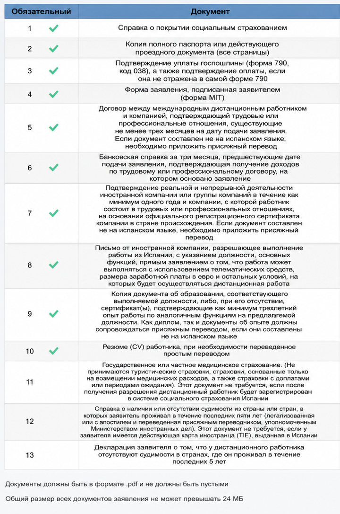

# Полный список документов для визы и ВНЖ цифрового кочевника в Испании для тех, кто работает в найме

> Помощь в подаче документов на ВНЖ Испании: [ **t.me/ola_espana**](https://t.me/ola_espana)

Полный список документов для визы и ВНЖ цифрового кочевника в Испании для заявителя из России, который работает дистанционно по трудовому договору с компанией или группой компаний за пределами Испании. В испанских источниках эта категория называется teletrabajador internacional por cuenta ajena.

Если вы работаете с компаниями как независимый исполнитель, см. [документы для тех, кто работает по контракту](../docs/contract-work.html).

## Список документов

Ниже — основной список документов для подачи на визу или ВНЖ цифрового кочевника для тех, кто работает в найме. [Присяжный перевод](../docs/sworn-translation.html) (traducción jurada, также называют хурадо-переводом) — официальный перевод на испанский, выполненный присяжным переводчиком.

- **Подтверждение социального страхования.** Для сотрудника российского работодателя это свидетельство об отъезде, которое выдает Социальный фонд России (СФР). Для подачи готовят бумажный оригинал, апостиль и присяжный перевод. См. [Свидетельство СФР](../docs/social-security-certificate.html).
- **Паспорт.** Полная копия действующего загранпаспорта — все страницы, включая пустые.
- **Госпошлина Tasa 790 038.** Форма государственной пошлины по заявлению и подтверждение оплаты.
- **Заявление MIT.** Официальная форма Formulario MIT, заполненная и подписанная заявителем или представителем. См. [Formulario MIT](../docs/formulario-mit.html).
- **Трудовой договор.** Подтверждает работу в найме и действующие трудовые отношения с работодателем за пределами Испании. На дату подачи отношения должны существовать не менее 3 месяцев; из договора и дополнительных соглашений должно быть понятно, что работа может выполняться дистанционно из Испании.
- **Банковская выписка за последние 3 месяца.** Показывает фактическое поступление заработной платы. См. [Банковская выписка](../docs/bank-statement.html).
- **Документы о регистрации работодателя.** Подтверждают, что работодатель реально существует и ведет деятельность не менее 1 года. Для российского юридического лица нужна бумажная выписка из ЕГРЮЛ; для ИП — выписка из ЕГРИП. См. [Документы компании](../docs/company-registration.html).
- **Письмо работодателя о дистанционной работе из Испании.** Работодатель подтверждает разрешение работать удалённо из Испании, должность, функции, удалённый формат, сохранение трудовых отношений, зарплату и основные условия работы. См. [Письмо компании](../docs/client-letter.html).
- **Диплом или подтверждение профессионального опыта.** Профильное образование либо не менее 3 лет профессионального опыта в функциях, аналогичных заявленной работе. См. [Апостиль диплома](../docs/diploma-apostille.html), [Выписка из трудовой](../docs/electronic-work-record.html) и [присяжный перевод](../docs/sworn-translation.html).
- **[Резюме (CV)](../docs/cv.html) на испанском.** Краткое резюме с образованием, профессиональным опытом, текущей должностью и навыками.
- **Медицинское страхование.** Если заявитель не подтверждает государственное медицинское покрытие в Испании, для подачи нужен частный медицинский полис испанской страховой компании. [Подробнее о страховке](#медицинская-страховка-для-тех-кто-работает-в-найме).
- **[Справка о несудимости](../docs/criminal-record-certificate.html).** При первичной подаче подтверждает отсутствие судимости в странах проживания за последние 2 года, если не действует исключение UGE.
- **Декларация об отсутствии судимости за последние 5 лет** (<a href="../assets/files/Declaracion_responsable_antecedentes_penales.pdf" download>скачать</a>). Отдельная декларация заявителя на испанском языке.
- **Зарплатные листы за последние 3 месяца.** Подтверждают начисленную заработную плату и регулярность дохода.
- **[Подтверждение легального нахождения в Испании](../docs/legal-stay-in-spain.html).** Нужно при подаче на ВНЖ из Испании.
- **Сопроводительное письмо.** Коротко объясняет состав пакета, нестандартные документы, объединенные файлы и места их загрузки.
- **Документ о назначении представителя — если подаёт представитель.** Designación de representante подтверждает полномочия представителя.

## Пример состава пакета для подачи

Пример названий файлов для тех, кто работает в найме. Файлы 01–13 идут в порядке полей формы UGE; остальные загружаются в раздел дополнительных документов.

1. `01_Certificado_cobertura_Seguridad_Social.pdf` — свидетельство СФР об отъезде или другое подтверждение применимого социального страхования.
2. `02_Pasaporte.pdf` — полный загранпаспорт, все страницы.
3. `03_Tasa_790_038.pdf` — госпошлина Tasa 790 038 и подтверждение оплаты.
4. `04_Formulario_MIT.pdf` — заполненное и подписанное заявление MIT.
5. `05_Contrato_laboral.pdf` — трудовой договор и, при необходимости, дополнительное соглашение об удалённой работе из Испании.
6. `06_Certificado_bancario_ultimos_3_meses.pdf` — банковская выписка или сертификат с поступлениями зарплаты за последние 3 месяца.
7. `07_Certificado_registro_empresa.pdf` — документ о регистрации работодателя; для российского юрлица — выписка из ЕГРЮЛ.
8. `08_Carta_empresa.pdf` — письмо работодателя с разрешением работать удалённо из Испании.
9. `09_Titulo_o_experiencia.pdf` — диплом либо документы, подтверждающие профессиональный опыт.
10. `10_CV.pdf` — резюме заявителя на испанском.
11. `11_Seguro_medico.pdf` — сертификат медицинской страховки.
12. `12_Certificado_antecedentes_penales.pdf` — справка о несудимости, если она требуется.
13. `13_Declaracion_responsable_antecedentes.pdf` — декларация об отсутствии судимости за последние 5 лет.

### Дополнительные документы

- `Carta_explicativa.pdf` — сопроводительное письмо.
- `Nominas_ultimos_3_meses.pdf` — зарплатные листы за последние 3 месяца.
- `Estancia_regular_en_Espana.pdf` — загранпаспорт с доказательством въезда или легального пребывания либо TIE.
- `Representacion.pdf` — документ о назначении представителя, если заявление подаёт представитель.

## Медицинская страховка для тех, кто работает в найме

Если нет подтвержденного государственного медицинского покрытия в Испании, для визы или ВНЖ цифрового кочевника нужен частный медицинский полис **испанской страховой компании** с полноценным покрытием на территории Испании.

Для иммиграционной подачи выбирайте полис **без доплат за каждое посещение врача, анализ или другую медицинскую услугу** — sin copagos. Также в полисе не должно быть периодов ожидания (carencias) по основным медицинским и госпитальным услугам. Не подходят полисы, основанные только на возмещении понесённых медицинских расходов.

Перед оплатой попросите у страховой или агента **сертификат для подачи на ВНЖ или визу**. В нем должны быть указаны застрахованный, дата начала полиса и характер покрытия.

Примеры подходящих по формату страховых продуктов: **DKV Visado**, **AXA Óptima** и **Sanitas Residents**. Перед оформлением проверяйте условия конкретного тарифа на дату подачи.

## Раздел с файлами в форме подачи

Основные документы загружаются в свои поля электронной формы UGE, а документы без отдельного поля — в раздел «Другие документы».

_Раздел с файлами в форме подачи для тех, кто работает в найме._

## Официальные ссылки

Закон, памятка UGE, страница подачи и другие официальные ресурсы собраны на странице [Полезные ссылки](../docs/links.html).

## Полный список документов для визы и ВНЖ цифрового кочевника в Испании для тех, кто работает в найме

На этой странице представлен **полный список документов для визы и ВНЖ цифрового кочевника в Испании для тех, кто работает в найме**: заявление MIT, трудовой договор, письмо работодателя, подтверждение социального страхования, дохода, квалификации, медицинского покрытия и отсутствия судимости.
