# Апостиль диплома через Госуслуги

Как подать заявление онлайн и получить бумажный апостиль на оригинале российского диплома.

## Как это работает

Госуслуги → загружаете скан диплома и приложения → ведомство проверяет документ → получаете уведомление → приносите оригинал диплома и приложение в ведомство, которое выбрали при подаче → там на оригинал диплома или на прикреплённый к нему лист ставят бумажный апостиль.

Загруженный на Госуслуги файл нужен для проверки. Сам бумажный апостиль ставится на оригинал документа.

## Подача через Госуслуги

**Откройте услугу**

[«Проставление апостиля на документах об образовании, учёных степенях, званиях»](https://www.gosuslugi.ru/620203/1/form)

**«Начать»**

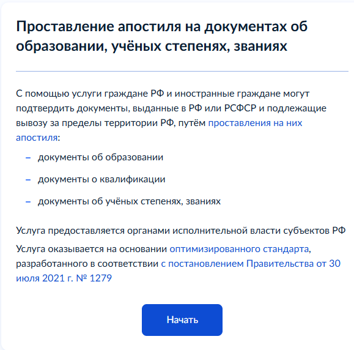

**Где выдан документ**

«Документ для апостиля выдан российской организацией либо на территории РФ или РСФСР?»

Да / Нет

**Вы являетесь обладателем документа**

Да / Нет

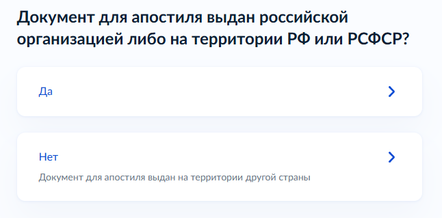

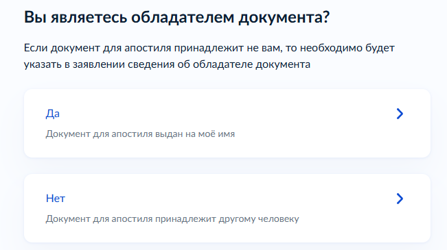

**Вы меняли ФИО**

Нет / Да

Если ФИО в дипломе отличается от текущих, Госуслуги попросят указать прежние данные.

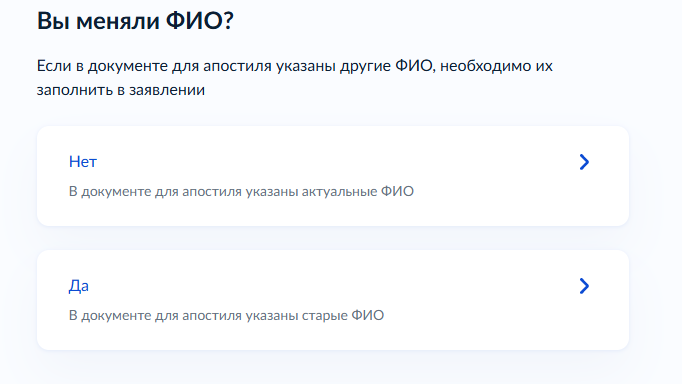

**Что хотите получить**

**«Реестровую выписку и штамп апостиля»** / «Реестровую выписку»

Для бумажного апостиля нужен первый вариант. Он предусматривает проставление апостиля на оригинале диплома или на отдельном листе, который скрепляют с оригиналом.

Если выбрать только «Реестровую выписку», бумажный апостиль на оригинал не ставится.

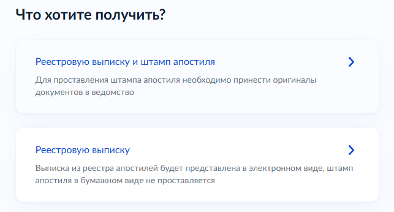

**Как хотите получить штамп апостиля**

**«Лично в ведомстве»** / «Почтовым отправлением наложенным платежом»

В этой инструкции используем личное получение: после проверки заявления оригинал диплома нужно будет передать в выбранное ведомство.

**Вам нужна выписка на иностранном языке**

Да / **Нет**

Для подачи диплома в Испании отдельная реестровая выписка на иностранном языке не нужна. Нужен сам диплом с бумажным апостилем.

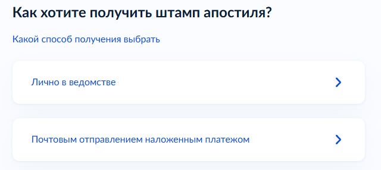

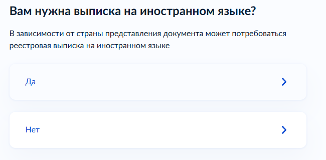

**Выберите регион подачи заявления**

Выберите регион, в котором будет удобно передать оригинал диплома и получить готовый документ.

Госуслуги покажут конкретное ведомство, его адрес и контакты.

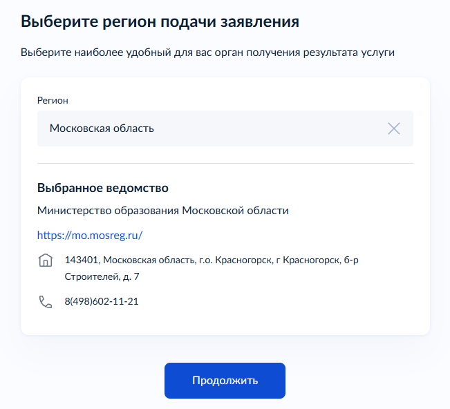

**Что нужно для подачи заявления**

На этом экране Госуслуги показывают, какие сведения понадобятся, стоимость и срок.

**Госпошлина — 2 500 ₽.**

На Госуслугах указан максимальный срок оказания услуги — **25 рабочих дней**.

Перед отправкой заявление потребуется подписать электронной подписью.

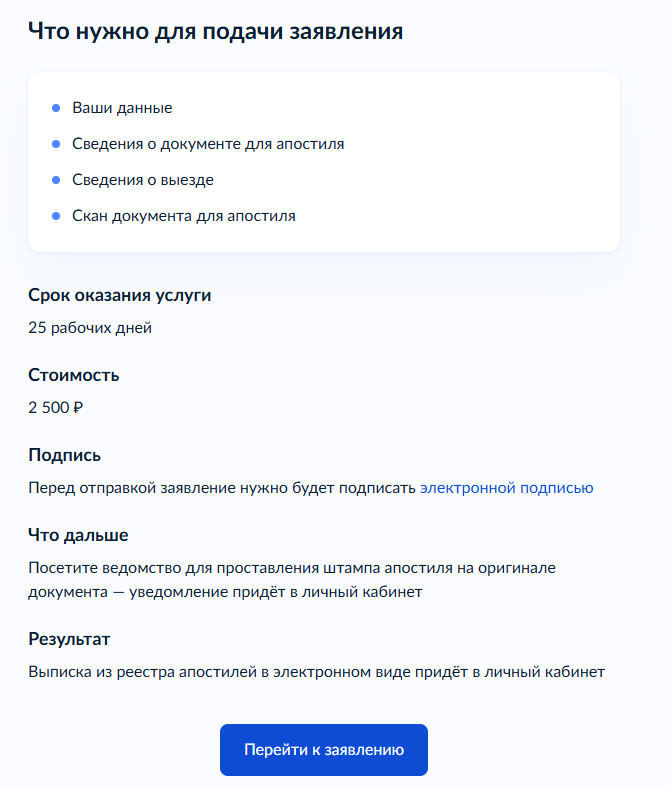

**Проверьте ваши данные**

Проверьте сведения, которые Госуслуги автоматически подставили из профиля, и продолжайте.

**У вас есть номер записи ЕРН**

Да / Нет

Если номер вам неизвестен, специально искать его ради подачи заявления не требуется.

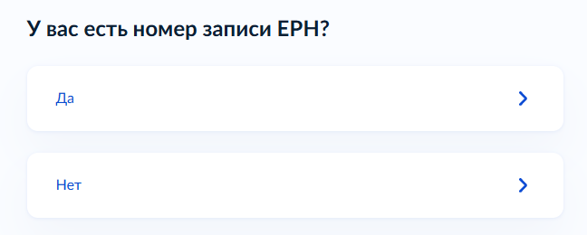

**Выберите документ для апостиля**

Укажите уровень образования и тип документа.

После этого Госуслуги предложат выбрать документ из реестра.

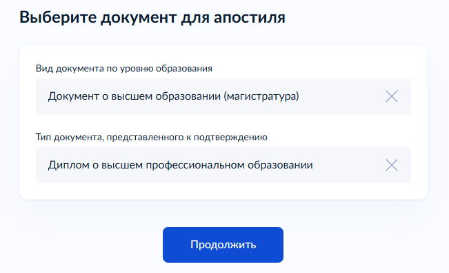

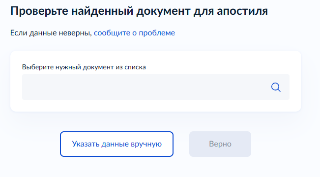

Если диплом найден, выберите его и проверьте данные. Если нет — «Указать данные вручную».

**Выберите страну предъявления документа**

**Испания**

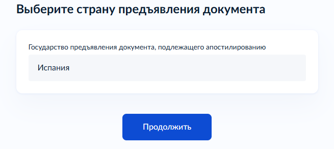

**Загрузите документы**

Загрузите **все страницы диплома и все страницы приложения к нему**.

Можно загрузить один файл в формате **PDF или ZIP до 25 МБ**.

Удобнее всего собрать всё в один PDF: диплом → все страницы приложения.

Сканы должны быть читаемыми, без обрезанных краёв и закрытых данных.

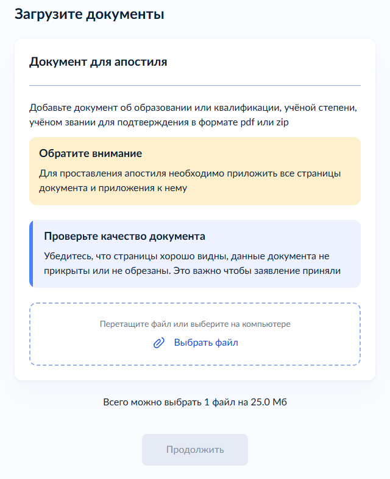

**Отправьте заявление и оплатите госпошлину**

Завершите заполнение формы, подпишите заявление электронной подписью и отправьте его.

После подачи оплатите госпошлину **2 500 ₽**, когда в личном кабинете появится начисление или инструкция по оплате.

**Дождитесь уведомления**

Ведомство проверит заявление и сведения о дипломе.

Сразу после отправки заявления ехать в ведомство не нужно. Дождитесь уведомления в личном кабинете Госуслуг.

Если для проверки понадобятся дополнительные сведения, общий срок может составить до **25 рабочих дней**.

**Передайте оригинал в ведомство**

После уведомления принесите **оригинал диплома и приложение** в ведомство, которое выбрали при подаче заявления.

Именно на оригинал диплома или на отдельный лист, скреплённый с ним, будет поставлен бумажный апостиль.

После передачи оригинала апостиль проставляется в течение **5 рабочих дней**.

**Получите готовый документ**

Заберите оригинал диплома с приложением и бумажным апостилем.

Реестровая выписка об апостиле придёт в личный кабинет Госуслуг в электронном виде.

## Источник

[Правила подтверждения документов об образовании и квалификации](https://www.consultant.ru/document/cons_doc_LAW_461777/3a45301b9bd6d84fb5aeeda0b8a4282e64783249/)
