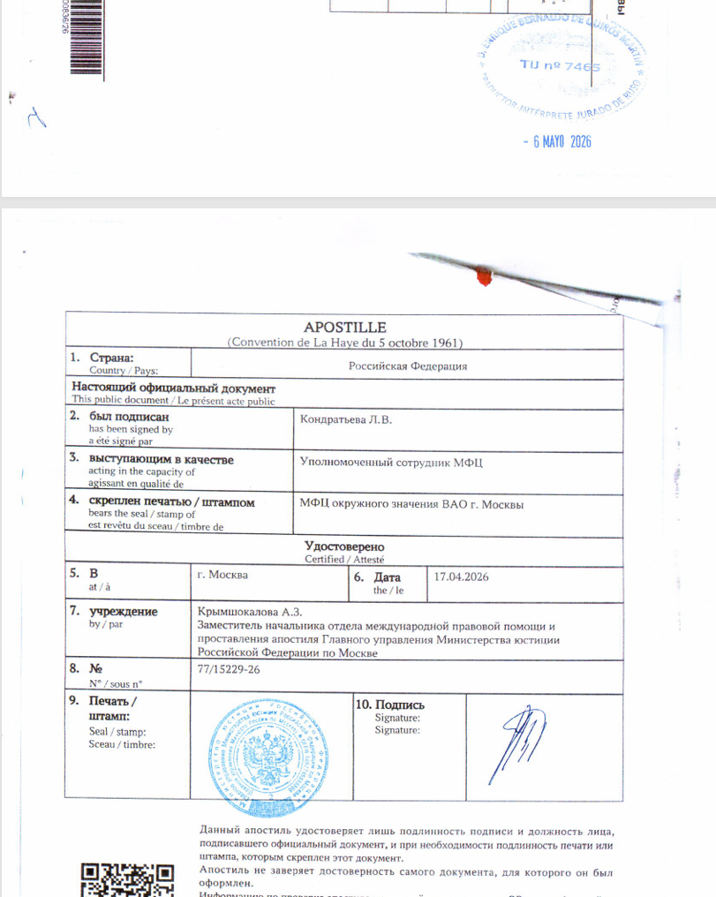
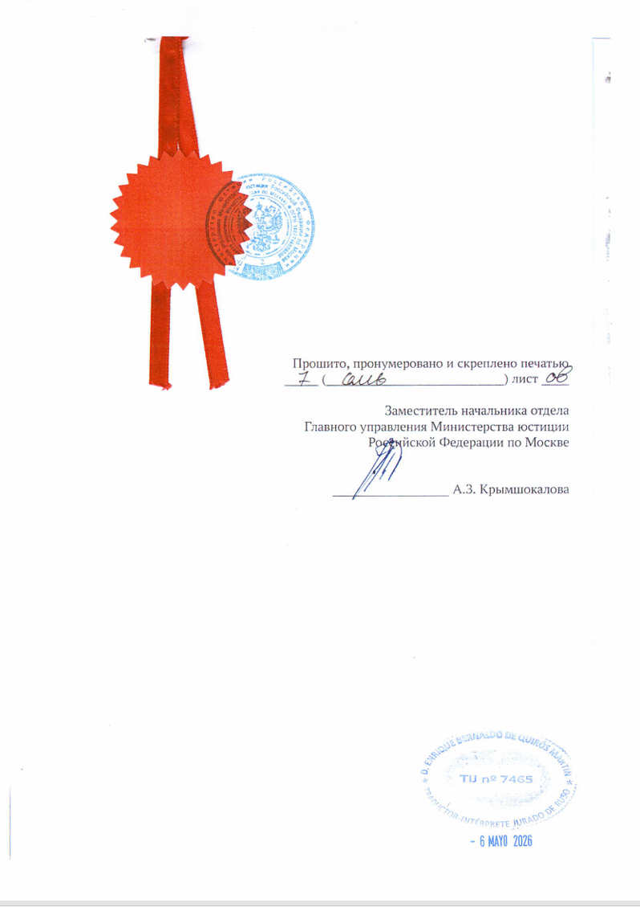

# Выписка из электронной трудовой книжки

Для подачи по Digital Nomad нужна бумажная выписка СТД-СФР с апостилем и присяжным переводом.

СТД-СФР - это сведения о трудовой деятельности из Социального фонда России. PDF с Госуслуг не используйте как финальный документ: его можно скачать для проверки данных, но для апостиля нужен бумажный официальный документ с подписью и печатью.

## Где получать

Идите во флагманский МФЦ или в другой МФЦ, где могут:

- выдать бумажную СТД-СФР;
- оформить ее с подписью, печатью, прошивкой и нумерацией;
- принять этот же документ на апостиль.

Это основной маршрут: в одном месте получаете выписку и сразу сдаете ее на апостилирование.

Запрос формулируйте так:

> Мне нужна бумажная выписка СТД-СФР для апостиля. Документ нужен с подписью, печатью, прошивкой и нумерацией страниц. После выдачи хочу сразу подать его на апостиль.

Если МФЦ не выдает бумажную СТД-СФР или не может оформить ее нормально, идите в территориальное отделение СФР. Там получите бумажную СТД-СФР с подписью, печатью, прошивкой и нумерацией, а потом отдельно подайте ее на апостиль через МФЦ или напрямую в Минюст.

Если сотрудник предлагает электронную выписку, отвечайте:

> Мне не нужна электронная выписка с Госуслуг. Мне нужен бумажный документ, который можно передать в Минюст на апостиль.

## Как должен выглядеть документ

Проверьте до подачи на апостиль:

- это форма СТД-СФР;
- есть подпись уполномоченного лица;
- есть печать;
- все страницы пронумерованы;
- документ прошит;
- прошивка скреплена печатью;
- ФИО, дата рождения, СНИЛС и записи о работе указаны без ошибок.

Если вам выдали несколько отдельных листов без прошивки, не несите это дальше. Просите переделать документ в виде, пригодном для апостиля.

Ниже - фрагменты последних страниц документа для наглядности. На примере видно сам лист апостиля, печать и подпись Минюста, скрепление документа, а также отметки на последней странице. Штамп с датой 6 мая относится к присяжному переводчику, а не к МФЦ.

## Если отправляют к нотариусу

Иногда сотрудник МФЦ или СФР говорит: "Идите к нотариусу, сделайте нотариальную копию, потом апостилируйте копию".

Это плохой маршрут для СТД-СФР.

Нотариус может отказаться заверять копию, если исходный документ сам оформлен плохо: отдельные листы, нет прошивки, нет нормального заверения. Даже если нотариус заверит копию, вы получите апостиль на нотариальное действие, а не на сам документ СФР.

Правильнее требовать нормально оформленный оригинал СТД-СФР:

> Прошу выдать СТД-СФР как официальный бумажный документ для апостиля: с подписью, печатью, прошивкой и нумерацией.

Если отказывают:

- пробуйте другого сотрудника;
- пробуйте другой МФЦ;
- идите в СФР;
- сдавайте правильно оформленный документ напрямую в Минюст.

## Что отвечать, если спрашивают страну

Если при подаче заявления спрашивают страну назначения, не называйте Испанию, если из-за этого отказываются принимать документы на апостиль.

Причина: сотрудник или система могут считать, что для Испании легализация не требуется, и на этом основании не принять заявление. В такой ситуации называют другую страну-участника Гаагской конвенции, для которой апостиль требуется, например Италию.

Формулировка:

> Документ нужен для предоставления за границей. Страна назначения - Италия.

Сам апостиль не содержит страну назначения. Он подтверждает подпись, печать и полномочия лица, подписавшего документ.

## Сроки и госпошлина

СТД-СФР через СФР или МФЦ при личном обращении выдают в день обращения.

Если сдаете документы напрямую в Минюст, официальный срок апостиля - 3 рабочих дня со дня поступления документов.

Если сдаете через МФЦ, ориентируйтесь на срок, который называет МФЦ. На практике могут говорить 10 дней: МФЦ принимает документы, передает их в Минюст и получает результат обратно, поэтому срок для заявителя длиннее, чем чистый срок Минюста.

Срок увеличивается до 30 рабочих дней, если Минюсту нужно проверить подпись, печать или полномочия сотрудника, который подписал СТД-СФР.

Госпошлина за апостиль - 2500 рублей за каждый документ.

По практическим кейсам:

- во флагманских МФЦ Москвы иногда укладывались примерно в 4-7 рабочих дней;
- если МФЦ называет 10 дней, закладывайте 10 дней;
- если Минюст запрашивает образец подписи или печати, процесс занимает несколько недель.

## Через доверенность

Документ можно оформить через представителя.

В доверенности должны быть полномочия:

- получать документы и сведения в СФР;
- обращаться в МФЦ;
- подавать документы на апостиль;
- получать готовые документы;
- подписывать заявления;
- оплачивать госпошлины.

Если доверенность оформлена за границей, заранее проверьте, в каком виде ее примут в России.

## После апостиля

После получения апостиля отдайте на присяжный перевод:

- саму СТД-СФР;
- лист апостиля;
- все страницы документа.

Не переводите только первую страницу. Перевод нужен на весь комплект.

## Проверьте полноту стажа

СТД-СФР не означает, что старого стажа в выписке не будет. У человека могут быть записи до 2020 года, если эти сведения внесены в электронную трудовую.

Но СФР отдельно указывает: электронная трудовая ведется с 2020 года, а бумажная трудовая остается источником сведений о работе до 2020 года. Поэтому не отправляйте СТД-СФР вслепую.

Перед апостилем сравните выписку с вашей бумажной трудовой и реальной историей работы. Проверьте:

- есть ли нужные работодатели;
- совпадают ли даты;
- видны ли должности;
- хватает ли информации для подтверждения 3 лет опыта, если вы подтверждаете именно опыт.

Если в СТД-СФР нет важного периода или запись слишком короткая для вашей задачи, готовьте дополнительное подтверждение: бумажную трудовую книжку, справку от работодателя, трудовой договор, приказ или другой документ по этому периоду.

## Короткий маршрут

1. Идите во флагманский МФЦ или МФЦ, который выдает бумажную СТД-СФР и принимает документы на апостиль.
2. Запросите бумажную СТД-СФР для апостиля.
3. Если МФЦ не выдает или не оформляет документ нормально, получите бумажную СТД-СФР в СФР.
4. Проверьте подпись, печать, прошивку и нумерацию.
5. Сдайте документ на апостиль через МФЦ или напрямую в Минюст.
6. Если спрашивают страну назначения, укажите Италию.
7. Получите апостилированный документ.
8. Сделайте присяжный перевод всего комплекта.

> Вопросы по подаче можно задать в Telegram: [**t.me/ola_espana**](https://t.me/ola_espana)

## Источники

- [СФР: сведения о трудовой деятельности](https://sfr.gov.ru/about/smev/perechen/uchet/~9787)
- [СФР: электронная трудовая книжка](https://sfr.gov.ru/grazhdanam/etk/)
- [Минюст: проставление апостиля](https://minjust.gov.ru/ru/activity/govservices/16/)
