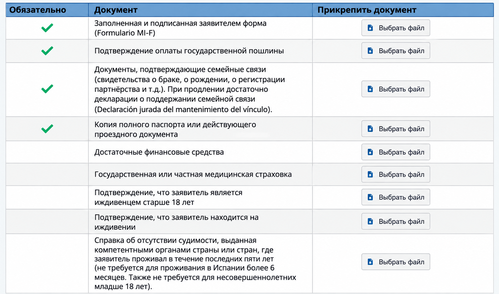

# ВНЖ цифрового кочевника в Испании: документы для члена семьи

> Помощь в подаче документов на ВНЖ Испании: [ **t.me/ola_espana**](https://t.me/ola_espana)

Этот гайд — для **члена семьи основного заявителя на ВНЖ цифрового кочевника**. Он подходит и когда основной заявитель подается **по найму** или **по контракту**.

Для каждого члена семьи отдельная подача. Податься можно **одновременно с основным заявителем** или позже, когда основной заявитель уже получил разрешение.

Разрешение члена семьи дает право **жить и работать в Испании без ограничений** — как по найму, так и на себя.

## Кто может подаваться как член семьи

По этой категории могут подаваться:

- супруг или супруга;
- зарегистрированный партнер или партнер в устойчивых отношениях;
- несовершеннолетние дети;
- совершеннолетние дети, которые материально зависят от основного заявителя и не создали собственную семью;
- родители и другие восходящие родственники, находящиеся на иждивении.

Для обычной подачи супруга или несовершеннолетнего ребенка пакет заметно проще. Для совершеннолетних детей и родителей нужно отдельно доказывать зависимость.

## Список документов

Здесь [`jurado` перевод](../docs/document-requirements.html#jurado-perevod) — официальный перевод, выполненный испанским присяжным переводчиком.

| Документы                                                                                                                                                                                                                                                                                                                                                                                                                                                                                                                                                                                  |
|--------------------------------------------------------------------------------------------------------------------------------------------------------------------------------------------------------------------------------------------------------------------------------------------------------------------------------------------------------------------------------------------------------------------------------------------------------------------------------------------------------------------------------------------------------------------------------------------|
| **Formulario MI-F** Подписанное заявление члена семьи. На каждого заявителя заполняется отдельная форма. [Официальная форма MI-F](https://ciudadaniaexterior.inclusion.gob.es/web/migraciones/modelos-de-solicitudes-de-la-ley-14/2013).                                                                                                                                                                                                                                                                                                                                                |
| **Tasa 790 038** На каждого заявителя оплачивается отдельная tasa, прикладывается подтверждение оплаты.                                                                                                                                                                                                                                                                                                                                                                                                                                                                                 |
| **Документ о родстве** Для супруга — свидетельство о браке, для ребенка — свидетельство о рождении, для зарегистрированной пары — документ о регистрации союза. **Российские документы ЗАГС не требуют апостиля для Испании**, но нужен [`jurado` перевод](../docs/document-requirements.html#jurado-perevod). При продлении UGE указывает, что достаточно declaración jurada о сохранении семейной связи. [Подробнее ↓](#family-link)                                                                                                                                                  |
| **Паспорт члена семьи** Полная копия действующего паспорта, **все страницы**.                                                                                                                                                                                                                                                                                                                                                                                                                                                                                                           |
| **Достаточные экономические средства — если член семьи подается после титуляра** При одновременной подаче титуляр подтверждает нужный доход с учетом всей семьи, и отдельный блок средств в expediente familiar дублировать не требуется. Если familiar присоединяется позже, средства титуляра подтверждаются заново. [Подробнее ↓](#family-income)                                                                                                                                                                                                                                    |
| **Государственное или частное медицинское страхование — если член семьи не получает покрытие через испанскую Seguridad Social или иное подтвержденное государственное покрытие в Испании** Для обычного супруга или ребенка титуляра по **контракту** / autónomo отдельный частный полис не нужен, если после одобрения титуляр входит в испанскую Seguridad Social и familiar имеет право быть beneficiario. Для типиченой ситуации **по найму** нужен частный полис, если нет отдельного документа о государственном медицинском покрытии в Испании. [Подробнее ↓](#family-insurance) |
| **Подтверждение экономической зависимости — если подается совершеннолетний ребенок** Нужно доказать, что ребенок соответствует условиям для подачи как зависимый член семьи. [Подробнее ↓](#adult-child)                                                                                                                                                                                                                                                                                                                                                                                |
| **Подтверждение нахождения на иждивении — если подается родитель или другой восходящий родственник** Нужно подтвердить реальную зависимость от основного заявителя или его супруга. [Подробнее ↓](#ascendant)                                                                                                                                                                                                                                                                                                                                                                           |
| **Справка о несудимости — для совершеннолетнего при первичной подаче, если не действует исключение UGE** Российская справка — **с апостилем + `jurado` переводом**. Не требуется лицам младше 18 лет. Также ее можно не подавать, если заявитель уже имеет испанское разрешение на проживание или пребывание сроком более 6 месяцев и соответствующая справка уже подавалась для его получения. [Подробнее](../docs/criminal-record-certificate.html)                                                                                                                                   |
| **Declaración responsable об отсутствии судимости за последние 5 лет — для совершеннолетнего заявителя** (<a href="../assets/files/Declaracion_responsable_antecedentes_penales.pdf" download>скачать</a>) Отдельная декларация на испанском; перевод не нужен.                                                                                                                                                                                                                                                                                                                                                                                                                           |
| **Подтверждение легального нахождения в Испании — если заявление подается из Испании** Нужно показать, что именно этот член семьи находится в Испании легально на дату подачи. `Declaración de entrada` прикладывается только когда она нужна для подтверждения конкретного въезда. [Подробнее](../docs/legal-stay-in-spain.html)                                                                                                                                                                                                                                                       |
| **Designación de representante — если заявление подает представитель** Документ должен давать представителю право подписать заявление и подать документы.                                                                                                                                                                                                                                                                                                                                                                                                                               |
| **Дополнительные документы — если их требует конкретный кейс** Например, нотариальное согласие второго родителя, дополнительные доказательства зависимости или пояснительное письмо.                                                                                                                                                                                                                                                                                                                                                                                                    |

## Форма подачи UGE

На скриншоте ниже — **раздел загрузки документов из электронной формы подачи UGE для члена семьи цифрового кочевника**. Документы, для которых в форме UGE нет отдельного поля, загружаются в раздел **«Остальные документы»**.

_Раздел загрузки документов в электронной форме подачи UGE для члена семьи._

## Документ о родстве

### Супруг или супруга

Приложите **свидетельство о браке**.

Для свидетельства, выданного российским ЗАГС:

- **апостиль не нужен**;
- нужен оригинал / официальный повторный документ;
- нужен [`jurado` перевод](../docs/document-requirements.html#jurado-perevod) на испанский.

Основание — **Canje de Notas entre España y la URSS de 24 de febrero de 1984** о взаимном признании свидетельств органов ЗАГС без легализации. Соглашение продолжает применяться между Испанией и Российской Федерацией. Консульство Испании в Москве прямо указывает, что российские свидетельства ЗАГС **не должны иметь апостиль**.

Это правило относится не только к браку, но и к другим российским свидетельствам ЗАГС, в том числе к **свидетельству о рождении**.

### Партнер

Если союз зарегистрирован, приложите свидетельство о регистрации pareja de hecho или аналогичный документ.

Если союз не зарегистрирован, UGE требует доказать устойчивые отношения. В обычном случае нужно подтвердить **не менее одного года непрерывного совместного проживания непосредственно перед подачей**. В качестве доказательств могут использоваться совместная регистрация по адресу, общий договор аренды или собственность, совместные банковские счета и другие документы.

Если у пары есть общий ребенок, год совместного проживания доказывать не требуется, но нужно подтвердить фактические отношения на момент подачи.

### Несовершеннолетний ребенок

Приложите **свидетельство о рождении**.

Если свидетельство выдано российским ЗАГС:

- **апостиль не нужен**;
- нужен [`jurado` перевод](../docs/document-requirements.html#jurado-perevod).

Для ребенка младше 18 лет **справка о несудимости не требуется**.

Если ребенок получает резиденцию с одним родителем, а второй родитель не участвует в подаче, UGE может потребовать нотариальное согласие второго родителя на проживание ребенка в Испании.

Важно: **нотариальное согласие — это не документ ЗАГС**, поэтому российско-испанское соглашение 1984 года на него не распространяется. Для российского нотариального согласия нужен **апостиль + `jurado` перевод**.

### Совершеннолетний ребенок

Для детей **от 18 до 25 лет включительно** UGE отдельно проверяет зависимость. Нужно подтвердить, что ребенок:

- не получает доход от работы или государственных выплат;
- учится в учебном заведении с возможностью продолжить обучение из Испании либо находится в активном поиске работы;
- не создал собственную семью.

Для детей **старше 26 лет** нужно доказать состояние, которое не позволяет им быть экономически самостоятельными.

### Родитель на иждивении

Нужно подтвердить само родство и реальную зависимость от основного заявителя или его супруга.

Для экономической зависимости UGE ориентируется, в частности, на помощь в течение **как минимум одного года до подачи**: переводы денег, оплату жилья и другие регулярные расходы. Также проверяется отсутствие собственного достаточного дохода.

Если зависимость связана со здоровьем, используются медицинские заключения и документы социальных служб.

Для восходящих родственников **старше 80 лет** UGE исходит из презумпции нахождения на иждивении.

## Доход на семью

Доход подтверждает **основной заявитель**, а не член семьи.

Минимум складывается так:

- основной заявитель — **200% SMI**;
- первый член семьи — дополнительно **75% SMI**;
- каждый следующий член семьи — дополнительно **25% SMI**.

В 2026 году SMI составляет 17 094 € в год. Если перевести его в среднемесячную сумму для расчета DNV, получается 1 424,50 €.

| Семья | Минимальный доход в месяц в 2026 году |
|---|---:|
| Только основной заявитель | 2 849,00 € |
| Основной заявитель + 1 член семьи | 3 917,38 € |
| Основной заявитель + 2 члена семьи | 4 273,50 € |
| Основной заявитель + 3 члена семьи | 4 629,63 € |

### Если подаетесь одновременно

По актуальной инструкции UGE, если заявления титуляра и членов семьи подаются одновременно, достаточно, чтобы **титуляр подтвердил достаточные средства с учетом всей семьи**. Отдельно дублировать весь блок доходов в каждом expediente familiar не требуется.

### Если член семьи подается после одобрения основного заявителя

UGE просит заново показать, что основной заявитель сейчас располагает достаточными средствами.

Если основной заявитель **работает по найму**, обычно прикладываются:

- трудовой договор;
- зарплатные листы за последние 3 месяца;
- банковский сертификат / выписка с поступлениями зарплаты за последние 3 месяца.

Если основной заявитель **работает по контракту / как autónomo**, обычно прикладываются:

- действующий контракт или контракты;
- инвойсы за последние 3 месяца;
- банковский сертификат / выписка с поступлениями по этим инвойсам за последние 3 месяца.

Если текущего дохода не хватает до установленного минимума, разницу можно закрыть **ликвидными сбережениями** на весь срок разрешения.

## Медицинская страховка

### Титуляр по контракту / autónomo

Если после одобрения титуляр регистрируется в испанской Seguridad Social как autónomo, UGE прямо указывает, что отдельный документ о частной медицинской страховке **не требуется**.

Если титуляр уже зарегистрирован в испанской Seguridad Social, при необходимости можно подтвердить его alta и право члена семьи быть beneficiario.

Исключение: **незарегистрированная pareja de hecho** не приобретает автоматически право быть beneficiario титуляра. Для такого партнера UGE отдельно требует частную медицинскую страховку.

### Титуляр по найму

Если титуляр по найму не будет включен в испанскую Seguridad Social и использует международное соглашение о социальном обеспечении, отсутствие частной страховки допустимо только при наличии **отдельного документа компетентного органа**, который прямо подтверждает медицинское покрытие члена семьи в Испании.

Российско-испанский **Convenio de Seguridad Social de 11 de abril de 1994** не включает медицинскую помощь (`asistencia sanitaria`) в перечень координируемых выплат и покрытий. Поэтому обычное свидетельство СФР о применимом законодательстве само по себе **не подтверждает медицинское покрытие в Испании** ни титуляра, ни семьи. Для типичного российского кейса по найму нужен **частный медицинский полис в Испании**, если нет другого документа, прямо подтверждающего право на испанское государственное медицинское покрытие.

UGE не принимает туристическую страховку, полис только с возмещением расходов, страховку с `copago` или с периодами ожидания (`carencia`).

## Несудимость

Совершеннолетнему члену семьи при первичной подаче нужны:

- справка о несудимости из страны или стран проживания за последние 2 года;
- declaración responsable об отсутствии судимости в странах проживания за последние 5 лет.

Справка не требуется лицам младше 18 лет.

Также UGE указывает исключение: справку можно не подавать, если заявитель уже имеет испанское разрешение на проживание или пребывание сроком более 6 месяцев **и эта справка уже подавалась для получения такого разрешения**.

## Легальное нахождение в Испании

Если заявление подается из Испании, сам член семьи должен находиться здесь легально на дату подачи.

Подтверждение въезда и нахождения готовится по той же логике, что и для основного заявителя: [см. отдельный гайд](../docs/legal-stay-in-spain.html).

`Declaración de entrada` — не универсальный обязательный файл для каждого familiar. Она нужна, если именно через нее подтверждается въезд / нахождение в конкретном кейсе.

## Пример пакета: супруг или супруга при одновременной подаче с autónomo

Для обычного совершеннолетнего супруга пакет выглядит примерно так:

1. `MI-F.pdf` — заявление члена семьи.
2. `Tasa_familiar.pdf` — tasa 790 038 и подтверждение оплаты.
3. `Marriage_certificate.pdf` — российское свидетельство о браке **без апостиля** + `jurado` перевод.
4. `Passport_familiar.pdf` — полный паспорт, все страницы.
5. `Certificate_non-criminal_record.pdf` — справка о несудимости **с апостилем** + `jurado` перевод.
6. `Declaracion_responsable_antecedentes.pdf` — декларация об отсутствии судимости за последние 5 лет.
7. `DECLARACION_DE_ENTRADA.pdf` или другой документ о легальном нахождении — **только если нужен по конкретному въезду**.
8. `DESIGNACION_DE_REPRESENTANTE.pdf` — **только если заявление подает представитель**.

При одновременной подаче:

- отдельную частную страховку супругу титуляра-autónomo **не прикладываем**, если титуляр после одобрения будет зарегистрирован в испанской Seguridad Social и супруг имеет право быть beneficiario;
- весь блок доходов титуляра в пакет супруга повторно **не обязателен** — достаточно, что титуляр подтвердил средства на всю семью;
- при первичной подаче `Declaración jurada de mantenimiento del vínculo familiar` не заменяет документ о родстве; в форме UGE эта декларация указана именно для **продлений**.

## Если подается ребенок

Для несовершеннолетнего ребенка базово нужны:

1. отдельный MI-F;
2. отдельная tasa 790 038;
3. свидетельство о рождении + `jurado` перевод;
4. паспорт ребенка, все страницы;
5. подтверждение легального нахождения в Испании;
6. при необходимости — нотариальное согласие второго родителя на проживание в Испании;
7. declaración responsable об отсутствии судимости за последние 5 лет — актуальная инструкция UGE оставляет этот документ в общем списке, отдельно освобождая несовершеннолетних только от самой справки о несудимости.

Для российского свидетельства о рождении **апостиль не нужен**. Для российского нотариального согласия второго родителя, если оно требуется, **апостиль нужен**.

## Если подается несколько членов семьи

На **каждого человека** создается отдельное заявление MI-F и оплачивается отдельная tasa 790 038.

Документы, относящиеся лично к члену семьи — паспорт, родство, несудимость (если требуется), подтверждение легального нахождения — прикладываются отдельно к его expediente.

<!-- PUBLIC_CONTENT_END -->

---

# Служебная часть: не публиковать

Файл пока существует только в `content/family-member.md`. HTML не создавать, в навигацию и sitemap не добавлять до отдельной команды.

## Основные официальные источники

- UGE, `SOLICITUDES INICIALES DE AUTORIZACIÓN PARA FAMILIARES DE TELETRABAJADORES DE CARÁCTER INTERNACIONAL`:  
  https://www.inclusion.gob.es/documents/d/unidadgrandesempresas/informacion-documentacion-pagina-web-familiares-v2
- Страница UGE по телеработникам, где отдельно даны документы титуляра и familiares:  
  https://www.inclusion.gob.es/es/web/unidadgrandesempresas/teletrabajadores
- Официальные модели Ley 14/2013, включая MI-F:  
  https://ciudadaniaexterior.inclusion.gob.es/web/migraciones/modelos-de-solicitudes-de-la-ley-14/2013
- FAQ UGE по teletrabajadores: право familiares работать без ограничений, проценты SMI, tasa 73,26 €:  
  https://ciudadaniaexterior.inclusion.gob.es/documents/d/unidadgrandesempresas/nomadas-digitales-faqs-espanol
- Консульство Испании в Москве: российские свидетельства ЗАГС не требуют апостиля; нотариальные документы требуют апостиля:  
  https://www.exteriores.gob.es/Consulados/moscu/es/ServiciosConsulares/Paginas/index.aspx?scca=Legalizaci%C3%B3n+o+Apostilla.+Compulsa+y+Registro&scco=Rusia&scd=203&scs=Legalizaci%C3%B3n+y+apostilla+de+la+Haya
- BOE: Canje de Notas entre España y la URSS de 24 de febrero de 1984:  
  https://www.boe.es/diario_boe/txt.php?id=BOE-A-1985-6208
- BOE 2024: подтверждение действующего применения соглашения к документам Российской Федерации:  
  https://www.boe.es/diario_boe/txt.php?id=BOE-A-2024-23023
- BOE: Convenio de Seguridad Social España—Rusia de 11 de abril de 1994; в перечне координируемых prestaciones нет asistencia sanitaria:  
  https://www.boe.es/buscar/doc.php?id=BOE-A-1996-4208
- SMI 2026: Real Decreto 126/2026, 17 094 € в год:  
  https://www.boe.es/eli/es/rd/2026/02/18/126

## Проверено перед публикацией

- Российские свидетельства ЗАГС (брак, рождение) для Испании не апостилируются: действует соглашение Испания—СССР 1984 года, применяемое к РФ.
- UGE требует `jurado` перевод иностранных публичных документов, не составленных на испанском.
- Российское нотариальное согласие на проживание ребенка в Испании не является документом ЗАГС: для него нужен апостиль и `jurado` перевод.
- При одновременной подаче familiares достаточно, чтобы титуляр подтвердил средства на всю семью; повторный полный блок доходов в каждом familiar не является отдельным требованием.
- Частная страховка familiar не нужна, когда титуляр после одобрения будет зарегистрирован в испанской Seguridad Social и familiar имеет право быть beneficiario. Для незарегистрированной pareja de hecho действует исключение.
- Для титуляра по найму, использующего иностранную систему соцстраха, отсутствие частной страховки familiar возможно только при наличии официального документа о медицинском покрытии этого familiar в Испании. Российско-испанский договор 1994 года медицинскую помощь не координирует, поэтому свидетельство СФР само по себе такого покрытия не дает.
- `Declaración jurada de mantenimiento del vínculo familiar` в самой форме UGE указана как достаточный документ **при продлении**, а не как замена свидетельства о родстве при первичной подаче.
