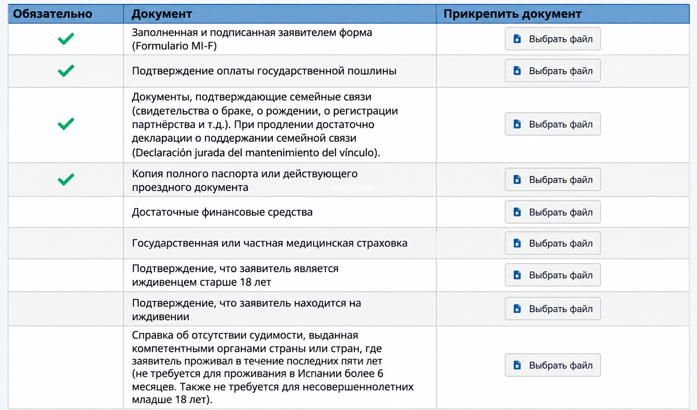

# Полный список документов для визы и ВНЖ цифрового кочевника в Испании для члена семьи

> Помощь в подаче документов на ВНЖ Испании: [ **t.me/ola_espana**](https://t.me/ola_espana)

Полный список документов для визы и ВНЖ цифрового кочевника в Испании для **супруга, партнера, ребенка и других членов семьи** основного заявителя.

Основной заявитель может [**работать в найме**](../docs/cuenta-ajena.html) или [**работать по контракту**](../docs/contract-work.html). Для каждого члена семьи создается отдельная подача: одновременно с основным заявителем или позже, после получения им разрешения.

Разрешение члена семьи по Ley 14/2013 дает право **жить и работать в Испании**; отдельное разрешение на работу не требуется.

## Кто может подаваться как член семьи

По этой категории могут подаваться:

- супруг или супруга;
- зарегистрированный партнер или партнер в устойчивых отношениях;
- несовершеннолетние дети;
- совершеннолетние дети, которые материально зависят от основного заявителя и не создали собственную семью;
- родители и другие восходящие родственники, находящиеся на иждивении.

Для обычной подачи супруга или несовершеннолетнего ребенка пакет заметно проще. Для совершеннолетних детей и родителей нужно отдельно доказывать зависимость.

## Список документов

Здесь [присяжный перевод](../docs/sworn-translation.html) — официальный перевод, выполненный испанским присяжным переводчиком.

| Документы |
|---|
| **Formulario MI-F** Подписанное заявление члена семьи. На каждого заявителя заполняется отдельная форма. [Официальная форма MI-F](https://ciudadaniaexterior.inclusion.gob.es/web/migraciones/modelos-de-solicitudes-de-la-ley-14/2013). |
| **Госпошлина Tasa 790 038** На каждого заявителя оплачивается отдельная госпошлина; прикладывается подтверждение оплаты. |
| **Документ о родстве** Для супруга — свидетельство о браке, для ребенка — свидетельство о рождении, для зарегистрированной пары — документ о регистрации союза. **Российские документы ЗАГС не требуют апостиля для Испании**, но нужен [присяжный перевод](../docs/sworn-translation.html). В памятке UGE по продлению для супруга предусмотрена декларация основного заявителя о сохранении семейной связи и совместного проживания. Повторное свидетельство о браке в этом перечне не указано. [Подробнее ↓](#family-link) |
| **Паспорт члена семьи** Полная копия действующего паспорта, **все страницы**. |
| **Экономические средства — если член семьи подается после основного заявителя** При одновременной подаче основной заявитель подтверждает необходимый доход с учетом всей семьи, поэтому отдельный блок средств в деле члена семьи дублировать не требуется. Если член семьи присоединяется позже, средства основного заявителя подтверждаются заново. [Подробнее ↓](#family-income) |
| **Государственное или частное медицинское страхование — если член семьи не получает покрытие через испанскую Seguridad Social или иное подтвержденное государственное покрытие в Испании** Для супруга или ребенка основного заявителя, который работает **по контракту / как autónomo**, отдельный частный полис не нужен, если после одобрения основной заявитель входит в испанскую Seguridad Social и член семьи имеет право на медицинское покрытие как *beneficiario*. Если основной заявитель **работает в найме**, частный полис нужен, когда нет отдельного документа, подтверждающего государственное медицинское покрытие члена семьи в Испании. [Подробнее ↓](#family-insurance) |
| **Подтверждение экономической зависимости — если подается совершеннолетний ребенок** Нужно доказать, что ребенок соответствует условиям для подачи как зависимый член семьи. [Подробнее ↓](#adult-child) |
| **Подтверждение нахождения на иждивении — если подается родитель или другой восходящий родственник** Нужно подтвердить реальную зависимость от основного заявителя или его супруга. [Подробнее ↓](#ascendant) |
| **Справка о несудимости — для совершеннолетнего при первичной подаче, если не действует исключение UGE** Российская справка — **с апостилем и присяжным переводом**. Не требуется лицам младше 18 лет. Также ее можно не подавать, если заявитель уже имеет испанское разрешение на проживание или пребывание сроком более 6 месяцев и соответствующая справка уже подавалась для его получения. [Подробнее](../docs/criminal-record-certificate.html) |
| **Декларация об отсутствии судимости за последние 5 лет — для совершеннолетнего заявителя** (<a href="../assets/files/Declaracion_responsable_antecedentes_penales.pdf" download>скачать</a>) Отдельная *declaración responsable* на испанском языке; перевод не нужен. |
| **Подтверждение легального нахождения в Испании — если заявление подается из Испании** Нужно показать, что именно этот член семьи находится в Испании легально на дату подачи. `Declaración de entrada` прикладывается только когда она нужна для подтверждения конкретного въезда. [Подробнее](../docs/legal-stay-in-spain.html) |
| **Документ о назначении представителя — если заявление подает представитель** *Designación de representante* должна давать представителю право подписать заявление и подать документы. |
| **Дополнительные документы — если их требует конкретный кейс** Например, нотариальное согласие второго родителя, дополнительные доказательства зависимости или пояснительное письмо. |

## Форма подачи UGE

На скриншоте ниже — **раздел загрузки документов из электронной формы подачи UGE для члена семьи цифрового кочевника**. Документы, для которых в форме UGE нет отдельного поля, загружаются в раздел **«Остальные документы»**.

_Раздел загрузки документов в электронной форме подачи UGE для члена семьи._

## Документ о родстве

### Супруг или супруга

Приложите **свидетельство о браке**.

В актуальной памятке UGE **срок давности свидетельства о браке не установлен**. Документ должен подтверждать семейную связь на дату подачи.

Для свидетельства, выданного российским ЗАГС:

- **апостиль не нужен**;
- нужен оригинал / официальный повторный документ;
- нужен [присяжный перевод](../docs/sworn-translation.html) на испанский.

Основание — **Canje de Notas entre España y la URSS de 24 de febrero de 1984** о взаимном признании свидетельств органов ЗАГС без легализации. Соглашение продолжает применяться между Испанией и Российской Федерацией. Консульство Испании в Москве прямо указывает, что российские свидетельства ЗАГС **не должны иметь апостиль**.

Это правило относится не только к браку, но и к другим российским свидетельствам ЗАГС, в том числе к **свидетельству о рождении**.

### Партнер

Если союз зарегистрирован, приложите свидетельство о регистрации pareja de hecho или аналогичный документ.

Если союз не зарегистрирован, UGE требует доказать устойчивые отношения и **не менее одного года непрерывного совместного проживания непосредственно перед подачей**. В памятке UGE в качестве примеров указаны общие банковские счета, совместная регистрация по адресу, общий договор аренды, ипотека или собственность, совместный бизнес; рекомендуется подтвердить **не менее двух** таких обстоятельств.

Если у пары есть общий ребенок, год совместного проживания доказывать не требуется, но нужно подтвердить фактические отношения на момент подачи.

### Несовершеннолетний ребенок

Приложите **свидетельство о рождении**. **Срок давности не установлен.**

Если свидетельство выдано российским ЗАГС:

- **апостиль не нужен**;
- нужен [присяжный перевод](../docs/sworn-translation.html).

Для ребенка младше 18 лет **справка о несудимости не требуется**.

Если несовершеннолетний не является ребенком основного заявителя или его супруга и не был усыновлен заявителем, который не является его родителем, актуальная памятка UGE требует нотариальное согласие другого родителя, прямо разрешающее проживание ребенка в Испании с подающим родителем. Для усыновления, оформленного за пределами ЕС, UGE также указывает на необходимость признания решения испанским судом (*exequátur*).

Важно: **нотариальное согласие — это не документ ЗАГС**, поэтому российско-испанское соглашение 1984 года на него не распространяется. Для российского нотариального согласия нужен **апостиль + присяжный перевод**.

### Совершеннолетний ребенок

Для совершеннолетних детей UGE отдельно проверяет зависимость. В памятке первая группа сформулирована как **«старше 18 и младше 26 лет»**. Для нее нужно подтвердить, что ребенок:

- не получает доход от работы или государственных выплат;
- учится в учебном заведении с возможностью продолжить обучение из Испании либо находится в активном поиске работы;
- не создал собственную семью.

Для детей **старше 26 лет** нужно доказать состояние, которое не позволяет им быть экономически самостоятельными.

Возраст **ровно 26 лет** в актуальной памятке UGE отдельно не оговорен: в ней указаны категории «старше 18 и младше 26» и «старше 26». Для такого случая лучше исходить из документов конкретного заявителя и, при необходимости, уточнять позицию UGE.

### Родитель на иждивении

Нужно подтвердить само родство и реальную зависимость от основного заявителя или его супруга.

Для экономической зависимости UGE просит показать устойчивую помощь **как минимум за один год до подачи**. Если родственник жил вместе с основным заявителем, подтверждается совместное проживание не менее года; если совместного проживания не было — помощь в оплате жилья и регулярная материальная поддержка минимум за год. Также подтверждается отсутствие дохода от работы и государственных выплат.

Если зависимость связана со здоровьем, используются медицинские заключения и документы социальных служб.

Для восходящих родственников **старше 80 лет** UGE исходит из презумпции нахождения на иждивении.

## Доход для семьи

При одновременной подаче основной заявитель подтверждает достаточные средства сразу с учетом всей семьи; отдельный полный блок доходов в каждом деле члена семьи дублировать не требуется.

Если член семьи подается после получения разрешения основным заявителем, заново прикладываются договор основного заявителя, инвойсы или зарплатные листы за последние 3 месяца и банковский сертификат с соответствующими поступлениями.

Если подтвержденный доход ниже установленного минимума, UGE разрешает закрыть разницу **ликвидными сбережениями или другими ликвидными доходами** на весь срок разрешения. Процентный лимит в памятке UGE не установлен.

## Медицинское покрытие

Если основной заявитель после одобрения будет зарегистрирован в испанской Seguridad Social, отдельный частный полис для члена семьи не требуется, когда он имеет право на медицинское покрытие как *beneficiario*. Если основной заявитель уже получил разрешение, при необходимости подтверждаются его регистрация в системе, уплата взносов и право члена семьи на такое покрытие.

Для незарегистрированного партнера UGE отдельно требует частную медицинскую страховку, поскольку такой партнер не приобретает автоматически право на покрытие как *beneficiario*.

Если основной заявитель покрыт международным соглашением о координации систем социального страхования, нужен отдельный документ компетентного органа, подтверждающий именно медицинское покрытие члена семьи в Испании.

UGE не принимает туристическую страховку, полис только с возмещением расходов, страховку с `copago` или с периодами ожидания (`carencia`).

## Несудимость

Совершеннолетнему члену семьи при первичной подаче нужны:

- справка о несудимости из страны или стран проживания за последние 2 года;
- декларация (*declaración responsable*) об отсутствии судимости в странах проживания за последние 5 лет.

Справка не требуется лицам младше 18 лет.

Также UGE указывает исключение: справку можно не подавать, если заявитель уже имеет испанское разрешение на проживание или пребывание сроком более 6 месяцев **и эта справка уже подавалась для получения такого разрешения**.

## Легальное нахождение в Испании

Если заявление подается из Испании, сам член семьи должен находиться здесь легально на дату подачи.

Подтверждение въезда и нахождения готовится по той же логике, что и для основного заявителя: [см. отдельный гайд](../docs/legal-stay-in-spain.html).

`Declaración de entrada` — не универсальный обязательный файл для каждого члена семьи. Она нужна, если именно через нее подтверждается въезд / нахождение в конкретном кейсе.

## Пример пакета: супруг или супруга при одновременной подаче с основным заявителем-autónomo

Для обычного совершеннолетнего супруга пакет выглядит примерно так:

1. `MI-F.pdf` — заявление члена семьи.
2. `Tasa_familiar.pdf` — госпошлина Tasa 790 038 и подтверждение оплаты.
3. `Marriage_certificate.pdf` — российское свидетельство о браке **без апостиля** + присяжный перевод.
4. `Passport_familiar.pdf` — полный паспорт, все страницы.
5. `Certificate_non-criminal_record.pdf` — справка о несудимости **с апостилем** + присяжный перевод.
6. `Declaracion_responsable_antecedentes.pdf` — декларация об отсутствии судимости за последние 5 лет.
7. `DECLARACION_DE_ENTRADA.pdf` или другой документ о легальном нахождении — **только если нужен по конкретному въезду**.
8. `DESIGNACION_DE_REPRESENTANTE.pdf` — **только если заявление подает представитель**.

При одновременной подаче:

- отдельную частную страховку супругу основного заявителя, работающего как autónomo, **не прикладываем**, если основной заявитель после одобрения будет зарегистрирован в испанской Seguridad Social и супруг имеет право быть beneficiario;
- весь блок доходов основного заявителя в пакет супруга повторно **не обязателен** — достаточно, что основной заявитель подтвердил средства на всю семью;
- при первичной подаче `Declaración jurada de mantenimiento del vínculo familiar` не заменяет документ о родстве; в форме UGE эта декларация указана именно для **продлений**.

## Если подается ребенок

Для несовершеннолетнего ребенка базово нужны:

1. отдельный MI-F;
2. отдельная госпошлина Tasa 790 038;
3. свидетельство о рождении + присяжный перевод;
4. паспорт ребенка, все страницы;
5. подтверждение легального нахождения в Испании;
6. при необходимости — нотариальное согласие второго родителя на проживание в Испании;
7. декларация об отсутствии судимости за последние 5 лет — актуальная памятка UGE оставляет этот документ в общем списке, отдельно освобождая несовершеннолетних только от самой справки о несудимости.

Для российского свидетельства о рождении **апостиль не нужен**. Для российского нотариального согласия второго родителя, если оно требуется, **апостиль нужен**.

## Если подается несколько членов семьи

На **каждого человека** создается отдельное заявление MI-F и оплачивается отдельная госпошлина Tasa 790 038.

Документы, относящиеся лично к члену семьи — паспорт, родство, несудимость (если требуется), подтверждение легального нахождения — прикладываются отдельно к его делу.

## Документы для семьи цифрового кочевника в Испании

На этой странице собран **полный список документов для визы и ВНЖ цифрового кочевника в Испании для члена семьи**: супруга или супруги, партнера, ребенка или зависимого восходящего родственника. Для каждого члена семьи подается отдельное заявление MI-F и оплачивается отдельная госпошлина.

Для семьи цифрового кочевника особенно важны документы о родстве, подтверждение достаточного дохода основного заявителя, медицинское покрытие, несудимость для совершеннолетних и легальное нахождение в Испании при подаче из Испании.

<!-- PUBLIC_CONTENT_END -->

---

# Служебная часть: не публиковать

Страница опубликована как `docs/family-member.html` и включена в навигацию и sitemap. При изменениях публичной части синхронизировать этот источник с опубликованным HTML.

## Основные официальные источники

- [Разъяснение DGGM от 30 июня 2025 года о документах, подтверждающих брак](https://www.inclusion.gob.es/documents/d/migraciones/20250701-criterio-dggm-acreditacion-vinculo-matrimonial): общего требования обновлять иностранное свидетельство по давности выдачи нет.
- [Памятка UGE по продлению](https://www.inclusion.gob.es/documents/1823432/1826095/renovaciones_feb_2018.pdf/7e4b1631-3f10-171a-eb21-5119133d01a5?t=1664875009918), стр. 3: декларация о сохранении семейной связи и совместного проживания.

- UGE, `SOLICITUDES INICIALES DE AUTORIZACIÓN PARA FAMILIARES DE TELETRABAJADORES DE CARÁCTER INTERNACIONAL`:  
  https://www.inclusion.gob.es/documents/d/unidadgrandesempresas/informacion-documentacion-pagina-web-familiares-v2
- Страница UGE по телеработникам, где отдельно даны документы титуляра и familiares:  
  https://www.inclusion.gob.es/es/web/unidadgrandesempresas/teletrabajadores
- Официальные модели Ley 14/2013, включая MI-F:  
  https://ciudadaniaexterior.inclusion.gob.es/web/migraciones/modelos-de-solicitudes-de-la-ley-14/2013
- FAQ UGE по teletrabajadores: право familiares работать без ограничений, проценты SMI, tasa 73,26 €:  
  https://ciudadaniaexterior.inclusion.gob.es/documents/d/unidadgrandesempresas/nomadas-digitales-faqs-espanol
- Консульство Испании в Москве: российские свидетельства ЗАГС не требуют апостиля; нотариальные документы требуют апостиля:  
  https://www.exteriores.gob.es/Consulados/moscu/es/ServiciosConsulares/Paginas/index.aspx?scca=Legalizaci%C3%B3n+o+Apostilla.+Compulsa+y+Registro&scco=Rusia&scd=203&scs=Legalizaci%C3%B3n+y+apostilla+de+la+Haya
- BOE: Canje de Notas entre España y la URSS de 24 de febrero de 1984:  
  https://www.boe.es/diario_boe/txt.php?id=BOE-A-1985-6208
- BOE 2024: подтверждение действующего применения соглашения к документам Российской Федерации:  
  https://www.boe.es/diario_boe/txt.php?id=BOE-A-2024-23023
- BOE: Convenio de Seguridad Social España—Rusia de 11 de abril de 1994; в перечне координируемых prestaciones нет asistencia sanitaria:  
  https://www.boe.es/buscar/doc.php?id=BOE-A-1996-4208
- SMI 2026: Real Decreto 126/2026, 17 094 € в год:  
  https://www.boe.es/eli/es/rd/2026/02/18/126

## Проверено перед публикацией

- Российские свидетельства ЗАГС (брак, рождение) для Испании не апостилируются: действует соглашение Испания—СССР 1984 года, применяемое к РФ.
- UGE требует присяжный перевод иностранных публичных документов, не составленных на испанском.
- Российское нотариальное согласие на проживание ребенка в Испании не является документом ЗАГС: для него нужен апостиль и присяжный перевод.
- При одновременной подаче familiares достаточно, чтобы титуляр подтвердил средства на всю семью; повторный полный блок доходов в каждом familiar не является отдельным требованием.
- Частная страховка familiar не нужна, когда титуляр после одобрения будет зарегистрирован в испанской Seguridad Social и familiar имеет право быть beneficiario. Для незарегистрированной pareja de hecho действует исключение.
- Для титуляра по найму, использующего иностранную систему соцстраха, отсутствие частной страховки familiar возможно только при наличии официального документа о медицинском покрытии этого familiar в Испании. Российско-испанский договор 1994 года медицинскую помощь не координирует, поэтому свидетельство СФР само по себе такого покрытия не дает.
- В общей памятке UGE по продлению разрешений по Ley 14/2013 (`renovaciones_feb_2018.pdf`, стр. 3, раздел 7.a «Cónyuge») предусмотрена декларация титуляра о сохранении семейной связи и совместного проживания; повторное свидетельство о браке в этом перечне не указано. Это памятка 2018 года, на которую UGE по-прежнему ссылается, а не отдельная актуальная инструкция по продлению для семей телеработников.

## Практика из базы чата: свежесть свидетельства о браке

- В `Doc/Telegram/topics/family.md` есть сообщения о дозапросах обновленного свидетельства, включая российское. Участники называют разные сроки; единого подтвержденного срока из этих сообщений не следует.
- 6 месяцев — рекомендация по подготовке пакета, а не обязательный срок UGE. В базе встречаются и другие ориентиры: например, `Espánium_2026-09-06/messages.html#message398` рекомендует 3 месяца и пересказывает устное разъяснение о годе.
