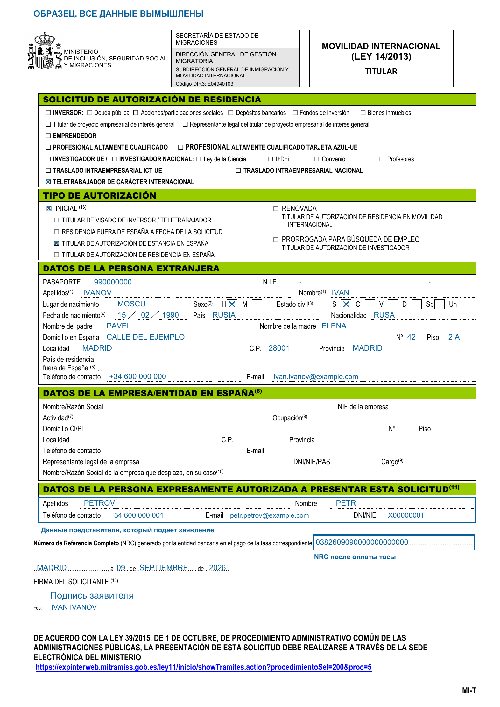

# Formulario MIT для ВНЖ номада в Испании: бланк и заполнение

> Помощь в подаче документов на ВНЖ Испании: [ **t.me/ola_espana**](https://t.me/ola_espana)

Гайд по заполнению заявления Formulario MIT (MI-T) для ВНЖ цифрового кочевника в Испании. Для основного заявителя, который подаётся <mark style="background-color: #dff1ff; color: inherit; white-space: nowrap;">по контракту</mark> или <mark style="background-color: #dff1ff; color: inherit; white-space: nowrap;">по найму</mark>.

[Бланк MI-T на сайте министерства](https://ciudadaniaexterior.inclusion.gob.es/web/migraciones/modelos-de-solicitudes-de-la-ley-14/2013).

## Как заполнить

1. Заполните форму на испанском; имя и фамилию укажите латиницей, как в загранпаспорте. Отметьте Teletrabajador de carácter internacional - цифровой кочевник, затем Inicial - первичная подача или Renovada - продление. При первичной подаче также отметьте основание текущего пребывания. Блок данных компании в Испании для номада не заполняется.
2. Если заявление подает представитель, в блоке Datos de la persona expresamente autorizada a presentar esta solicitud укажите **данные того, кто подает**: фамилию, имя, телефон, электронную почту и DNI/NIE. Для подачи через представителя также приложите документ о его полномочиях.
3. **После оплаты тасы 790 038 впишите NRC** из подтверждения оплаты в строку Número de Referencia Completo (NRC) внизу формы. Это код оплаченной тасы, не номер самого бланка.
4. Поставьте дату и подпись заявителя. Можно подписать электронной подписью или от руки и отсканировать.

## Пример

Первичная подача из Испании во время краткосрочного пребывания, через представителя. Заявитель - Иван Иванов, представитель - Петр Петров. NIE у заявителя еще нет, поэтому поле оставлено пустым. Все данные, включая NRC, вымышленные; подпись обозначена условно.

<!-- PUBLIC_CONTENT_END -->

---

# Служебная часть: не публиковать

Все ниже этой отсечки хранится только в Markdown и не переносится на сайт, в том числе в HTML-комментарии.

Материал подготовлен для сайта 9 сентября 2026 года. HTML-версия: `docs/formulario-mit.html`.

## Источники и образец

- [Официальная страница бланков по закону 14/2013](https://ciudadaniaexterior.inclusion.gob.es/web/migraciones/modelos-de-solicitudes-de-la-ley-14/2013): MI-T для основного заявителя; MI-F для членов семьи. Основная ссылка в статье ведет сюда, чтобы читатель мог выбрать редактируемую или печатную версию.
- [Официальный печатный бланк MI-T](https://ciudadaniaexterior.inclusion.gob.es/documents/d/migraciones/modelo-de-solicitud-de-autorizacion-de-residencia-titulares-1): использован для изображения. Страница 1 содержит отдельный блок подающего лица и строку NRC. Примечание 6 ограничивает заполнение блока испанской компании другими категориями; примечания 11-13 поясняют подачу, подпись и основания первичного обращения.
- [Подача заявлений и оплата тасы на сайте министерства](https://sede.inclusion.gob.es/w/presentacion-solicitudes-autorizacion-residencia): после оплаты 790 038 получают NRC; для физического лица предусмотрена электронная подпись как вариант подписания. Полномочия представителя подтверждаются отдельно.
- [Инструкция UGE для основного заявителя](https://ciudadaniaexterior.inclusion.gob.es/documents/d/unidadgrandesempresas/informacion-documentacion-pagina-web-titular-v2): заявление и оформление представительства. В образце выбрана подпись самого заявителя, а не представителя.
- Telegram: `C:\Projects\Nomad\processed_nomad\clean_messages.jsonl`, `Закрытый_чат_Продление_2026-09-06/messages9.html#message9616` от 14.07.2026. После повторной оплаты заявитель получил другой NRC и обновил его в MI-T. Это подтверждает практическую важность соответствия номера в форме актуальной оплате. Переписка и личные документы в репозиторий не переносились.
- Изображение: `assets/images/formulario-mit-example.png`. Учебная первая страница настоящего бланка, заполненная вымышленными данными. Выбраны цифровой кочевник, первичная подача и краткосрочное пребывание в Испании; блок компании оставлен пустым. Вторая страница с инструкциями в картинку не включена и остается в официальном PDF.
- NRC в образце состоит из 22 знаков, но не является кодом реального платежа. Адреса электронной почты используют зарезервированный домен `example.com`. Подпись не воспроизводится: стоит текст «Подпись заявителя».
- В поле `Nacionalidad` оставлено `RUSA`: российское гражданство. Это согласование со словом `nacionalidad`, а не обозначение пола заявителя. В официальной инструкции MI-T нет отдельного правила о написании гражданства или требования использовать код `RUS`. В соседнем поле `País` указано `RUSIA` как страна рождения. Формулировка `nacionalidad rusa` используется и на [сайте посольства Испании](https://www.exteriores.gob.es/Embajadas/moscu/es/ViajarA/Paginas/Establecerse.aspx).
- Изображение показано без ссылки и горизонтальной прокрутки: ширина 780 пикселей, но не шире колонки. Пропорции сохранены.
