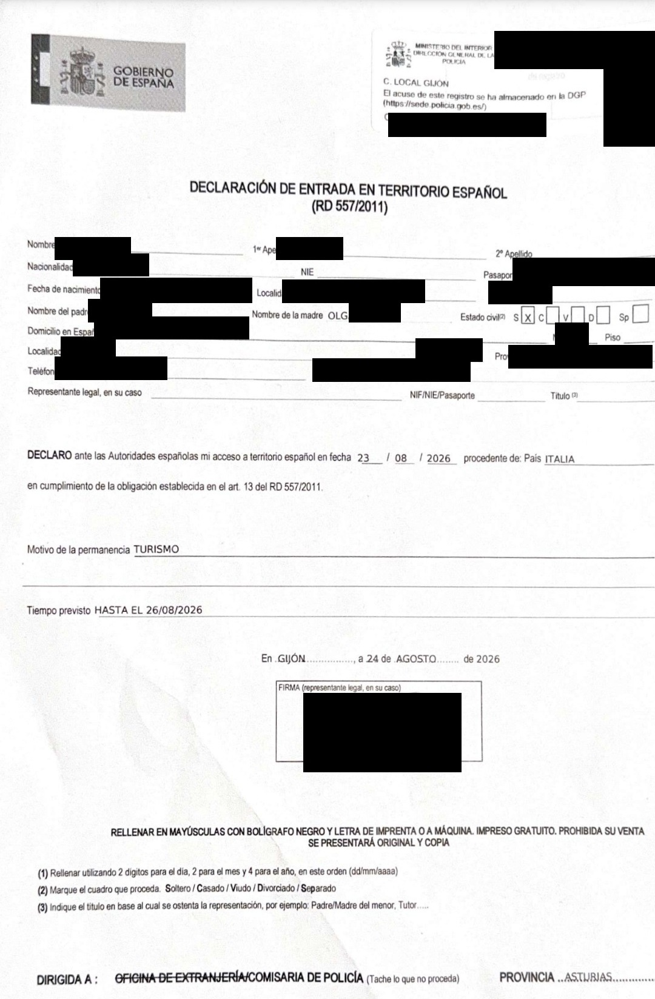

# Легальное нахождение в Испании

> Помощь в подаче документов на ВНЖ Испании: [ **t.me/ola_espana**](https://t.me/ola_espana)

Для первичной подачи на ВНЖ цифрового кочевника заявитель должен **находиться в Испании легально на дату подачи**.

Здесь важно не смешивать три разных вопроса:

1. **Как человек законно въехал в Шенген и не истек ли разрешенный срок пребывания.**
2. **Как подтверждается его въезд именно в Испанию.**
3. **Как подтверждается, что на дату подачи он физически находится в Испании.**

Один документ не всегда закрывает все три вопроса сразу.

Раньше видимым доказательством въезда служил штамп в паспорте. **С 10 апреля 2026 года при обычном краткосрочном въезде по визе C или безвизу его заменила [EES (Entry/Exit System)](https://home-affairs.ec.europa.eu/policies/schengen/smart-borders/entry-exit-system_en)** — электронная система регистрации въезда и выезда граждан третьих стран, приезжающих на короткий срок, например туристов. Она фиксирует дату и место пересечения внешней границы Шенгена. **Отсутствие штампа теперь нормально: запись о въезде хранится в EES.**

При прямом внешнем въезде в Испанию запись подтверждает прибытие в Испанию. При въезде через другую страну Шенгена она относится к этой стране, а последующий приезд в Испанию нужно подтверждать отдельно.

## Документы для подтверждения въезда и пребывания в Испании

### 1. Прямой въезд через Испанию

Например: **Стамбул → Мадрид**.

Сохраните:

- **посадочный талон ИЛИ справку авиакомпании о совершенном перелете**.

### 2. Въезд через другую страну Шенгена

Например: **Стамбул → Париж → Мадрид**.

Сохраните:

- **Declaración de entrada** — основной документ о прибытии именно в Испанию;
- **посадочный талон до Испании ИЛИ справку транспортной компании о совершенной поездке** — дополнительное доказательство поездки; если `Declaración de entrada` получить не удалось, эти документы могут использоваться для подтверждения нахождения в Испании перед UGE;
- **acta notarial de presencia** — дополнительное доказательство физического присутствия в Испании, если `Declaración de entrada` нет.

### Легальность пребывания

Помимо въезда, подтвердите законность пребывания: действующей **визой C**, **визой D** или другим законным основанием.

Документы о поездке подтверждают прибытие в Испанию, а виза или иное основание — легальность пребывания.

## Declaración de entrada: где и как получить

Если вы приехали в Испанию **из другой страны Шенгена** и у вас нет испанской резиденции, [`Declaración de entrada`](https://www.interior.gob.es/opencms/es/servicios-al-ciudadano/tramites-y-gestiones/extranjeria/regimen-general/entrada-requisitos-y-condiciones/) нужно оформить **в течение трех календарных дней** с момента въезда в Испанию.

По закону декларацию можно сделать в любой `Comisaría del Cuerpo Nacional de Policía`. На практике не каждое отделение и не каждая смена ее оформляет, поэтому действовать лучше так:

1. **Если прилетели самолетом — сначала попробуйте Policía Nacional в аэропорту сразу после прилета.** В аэропортах декларации оформляют, но в отдельных случаях могут отказать или направить в другое отделение.
2. **Если в аэропорту отказали — в тот же или на следующий день идите в городскую Policía Nacional.** Не откладывайте: срок три дня продолжает идти.

С собой возьмите:

- паспорт;
- **посадочный талон или билет**, которым вы приехали именно в Испанию;
- визу или ВНЖ другой страны Шенгена, если въезжали по нему;
- [официальный бланк Declaración de entrada](https://www.inclusion.gob.es/documents/d/migraciones/declaracion-de-entrada-en-territorio-espanol-editable) — лучше заполнить заранее и распечатать **оригинал и копию**.

Пример оформленной декларации (персональные данные скрыты):

### Если в аэропорту не оформили

Можно обратиться в городскую `Comisaría de Policía Nacional`. По закону подходит любая комиссария, но на практике прием по этой процедуре может отличаться.

- **Барселона:** `Passeig de Sant Joan, 189–193` или `Rambla Guipúscoa, 74`.
- **Валенсия:** `C/ dels Sapadors, 52–54, 46006 València`.
- **Мадрид:** например, `Comisaría de Policía Nacional Madrid-Centro`, `C/ Leganitos, 19, 28013 Madrid`.

То есть правило простое: **аэропорт — первый и самый удобный вариант, но отказ там не означает, что декларацию больше нигде не выдадут**. Ее также оформляют в городских отделениях Policía Nacional.

Если полиция все-таки не выдала `Declaración de entrada`, сохраните посадочный талон или получите справку перевозчика. Эти документы могут подтвердить нахождение в Испании для UGE, но **не отменяют саму обязанность оформить декларацию**, если она возникла по [статье 13 Reglamento de Extranjería](https://www.boe.es/eli/es/rd/2024/11/19/1155).

## Если есть выбор маршрута

Маршрут должен соответствовать условиям вашей визы и заявленной поездке. Для шенгенской визы C имеет значение **основная страна поездки**: обычно это страна, где находится основная цель поездки или где планируется провести больше всего времени. Если определить основную страну нельзя, учитывается страна первого въезда. При этом сама по себе виза, выданная одной страной Шенгена, обычно не обязывает пересекать внешнюю границу именно этой страны. [Правила подачи на шенгенскую визу](https://home-affairs.ec.europa.eu/policies/schengen/visa-policy/applying-schengen-visa_en).

**Если с точки зрения визовых правил допустимы несколько вариантов маршрута**, для подачи DNV проще въезжать в Шенген непосредственно через Испанию. В этом случае вы проходите внешний пограничный контроль в Испании и **не возникает отдельной обязанности оформлять `Declaración de entrada` после приезда из другой страны Шенгена**.

При этом не стоит рассчитывать только на запись EES: прямой доступ UGE к данным EES официально не подтвержден. Поэтому и при прямом въезде в Испанию сохраните **посадочный талон ИЛИ справку авиакомпании о совершенном перелете** и приложите их к подаче.

Например:

- **Стамбул → Мадрид** — внешний въезд происходит в Испании; `Declaración de entrada` не нужна, но посадочный талон или справку авиакомпании лучше сохранить;
- **Стамбул → Париж → Мадрид** — внешний въезд происходит во Франции; после приезда из Франции в Испанию нужно оформить `Declaración de entrada` и сохранить документ о поездке до Испании.
