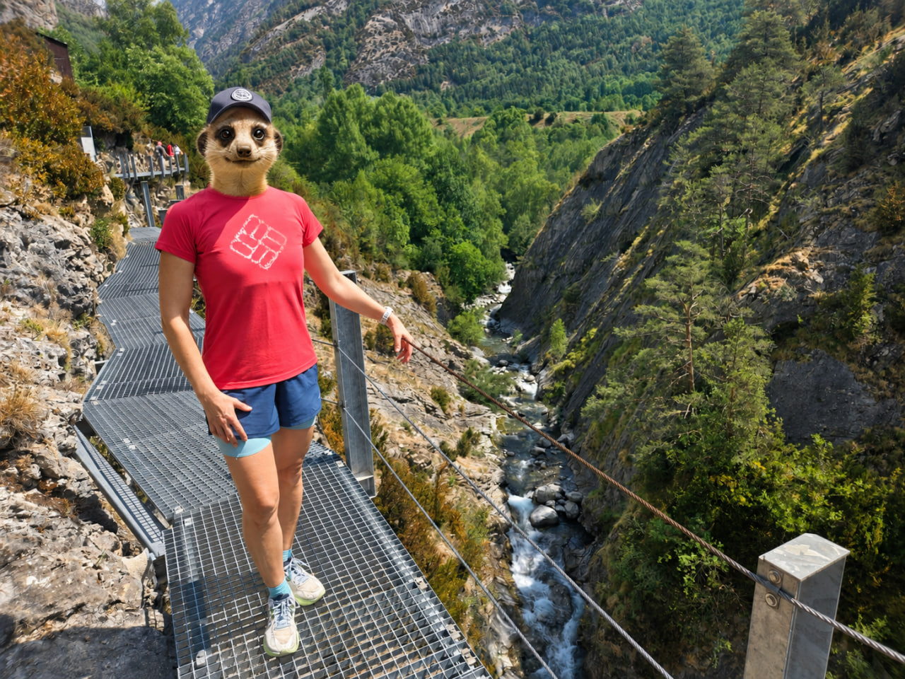

# Миграция в Испанию. Проблемы на старте. Жилье

Вот допустим, вы собрали все документы, получили шенгенскую визу и приехали, скорее всего, в один из крупных городов Испании. На первое время сняли отель или апартаменты. И за это жилье вы будете платить от 150 EUR в сутки.

Самый жесткий вариант - приехать летом в Барселону, Мадрид или Валенсию. За месяц набегает 4 500 EUR. В какой-то момент хочется все проклясть и уехать обратно. Но нет: читаем дальше, находим нормальный вариант и радуемся жизни.

Дальше подали документы на ВНЖ. Решение об одобрении, скорее всего, будете ждать около месяца. Потом нужно записаться на отпечатки пальцев для карточки ВНЖ. И возможно, уже на этом этапе понадобится прописка. В Испании это называется _empadronamiento_, или просто падрон. Потом еще несколько недель ждать саму карту.

Все это время жить в отеле не вариант. Летом пара недель в отеле легко съедает бюджет на аренду квартиры за месяц.

Логично снять квартиру. Но в Испании жилье обычно сдают надолго, а получить долгосрочный договор без ВНЖ фактически нереально.

Если вы переезжаете с октября по апрель, стоит попробовать снять туристическое жилье на несколько месяцев. В приморских городах летом оно уходит туристам, а вне сезона стоит заметно дешевле.

Мы с мужем так снимали квартиру помесячно в центре Валенсии за 1 100 EUR. Хозяйка, пожилая американка, согласилась сделать договор на полгода, чтобы мы могли прописаться. В сезон эта квартира, думаю, стоила бы минимум 200 EUR в сутки.

За эти месяцы мы спокойно выбирали постоянное жилье, не хватались за первый попавшийся вариант и нашли то, что нам действительно подходит. Но об этом расскажу в других постах.

## Что проверить до аренды

- Ищите туристическое жилье вне сезона через Facebook, Telegram-каналы и другие источники.
- Не переводите деньги заранее без договора.
- Обязательно уточняйте, можно ли сделать прописку в этой квартире.
