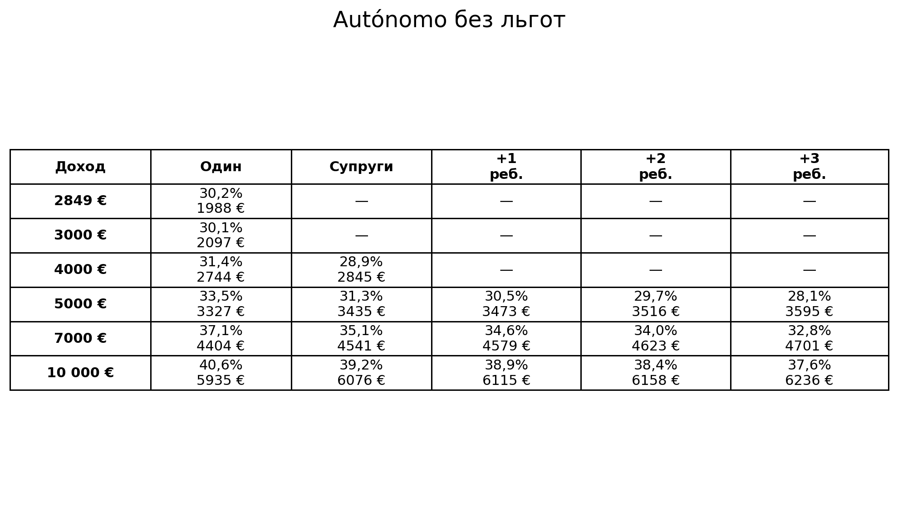
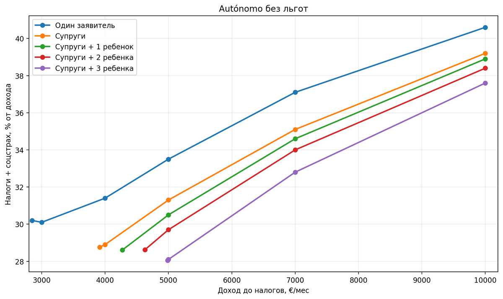
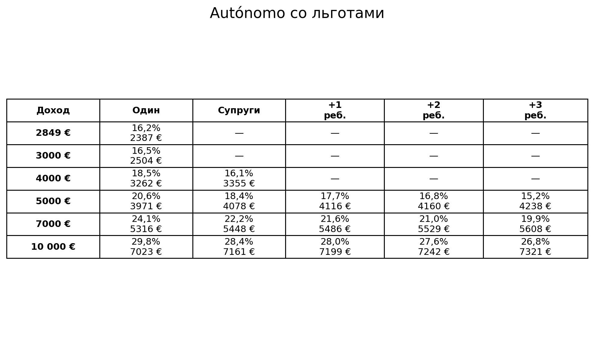
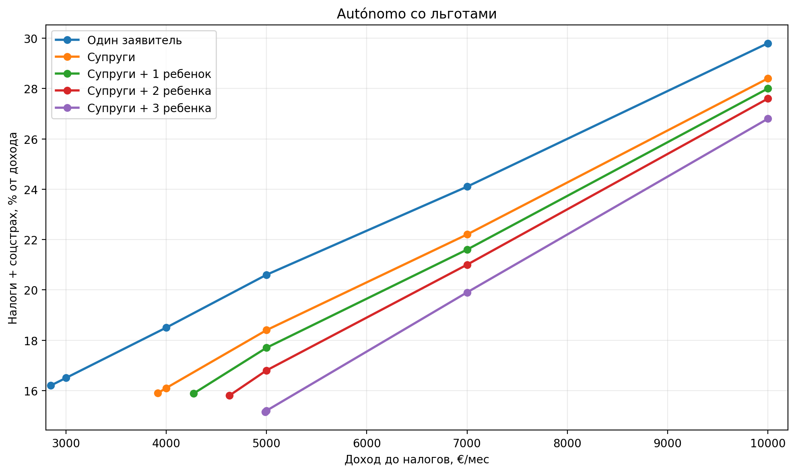
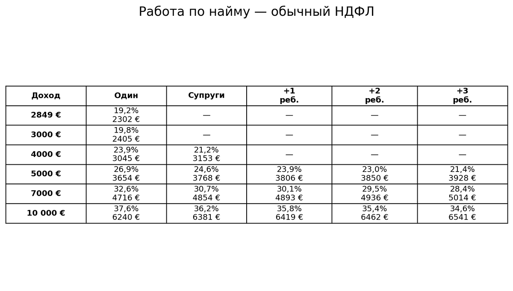
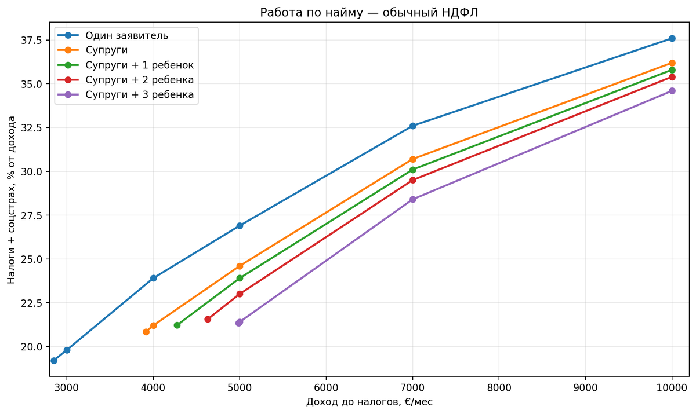

# Налоги цифрового кочевника в Испании: сколько остается после налогов и соцстраха

> Блог: [https://ola-espanola.github.io/blog/](https://ola-espanola.github.io/blog/) 
> Telegram-канал: [https://t.me/ola_espana](https://t.me/ola_espana)

Налоговая нагрузка цифрового кочевника в Испании зависит прежде всего от формата работы, уровня дохода, состава семьи и права на льготы. Ниже — сравнение работы по контракту через *autónomo* и работы по найму.

Одни только ставки налогов мало что говорят. Для переезда важнее другой вопрос: сколько денег реально остается после налогов, соцстраха и обязательных расходов. Поэтому ниже сравниваются несколько типовых вариантов для цифрового кочевника в Испании.

## Контракт и найм: где возникает основная разница

### Работа по контракту

Вы оказываете услуги иностранной компании как независимый специалист. После одобрения ВНЖ регистрируетесь в Испании как *autónomo* и сами платите IRPF и испанский социальный взнос.

### Работа по найму

Вы остаетесь сотрудником иностранной компании. Если для вас продолжает применяться российская система социального страхования, взносы платит работодатель в России. В Испании остаются IRPF и частная медицинская страховка.

Поэтому при одинаковом доходе обычная работа по найму часто оставляет больше денег на руках: у работника нет отдельного испанского взноса *autónomo*. На высоких доходах разница уменьшается, потому что все большую долю общей нагрузки составляет IRPF.

## Обычный autónomo без стартовых льгот

У работающего по контракту два основных обязательных платежа: IRPF и Seguridad Social. Социальный взнос зависит от дохода. При упрощенном учете расходов можно также учитывать 5% расходов без подтверждающих документов, но не более 2000 € в год.

Около минимального дохода для одного заявителя суммарная нагрузка получается примерно 30%. При доходе 5000 € в месяц она уже около трети, а при 10 000 € приближается к 40%.

## Что меняется у нового autónomo

На старте нагрузка может быть заметно ниже. Есть две льготы, которые при выполнении условий могут работать одновременно.

- **Сниженный социальный взнос.** В первые 12 месяцев при наличии права на льготу — около 89 € в месяц.
- **Снижение налоговой базы на 20%.** Для новой деятельности оно применяется в первый прибыльный налоговый год и следующий, если выполняются условия льготы.

На небольших доходах разница особенно заметна. При доходе около 3000 € обычный *autónomo* может отдавать около 30%, а при обеих стартовых льготах нагрузка может быть примерно 16%. Право на 20-процентное снижение нужно проверять отдельно: оно подходит не каждому новому *autónomo*.

## Если работать по найму

При найме расчет другой. Если сотрудник остается в российской системе социального страхования, отдельный испанский социальный взнос он не платит. В Испании остаются IRPF и частная медицинская страховка.

Стоимость страховки зависит от возраста, состава семьи и страховой компании. Для грубой оценки можно закладывать около 500—1000 € в год на человека. В налоговые таблицы ниже страховка не включается.

## Режим Бекхэма

Для части работающих по найму доступен специальный налоговый режим, который обычно называют режимом Бекхэма. Для трудового дохода до 600 000 € в год применяется ставка 24%.

Но сравнивать только ставку 24% с обычным IRPF неправильно. При специальном режиме семейное положение не дает обычных преимуществ совместной декларации и семейных налоговых минимумов. Поэтому на умеренном доходе стандартный режим для семьи может оказаться выгоднее. Фиксированная ставка становится интереснее по мере роста дохода.

## Минимальный доход для ВНЖ цифрового кочевника

Налоговую нагрузку имеет смысл смотреть вместе с минимальным доходом, который нужен для самой программы DNV. Для расчетов 2026 года:

- один заявитель — 2849 € в месяц;
- два человека — 3917 €;
- семья из трех человек — 4274 €;
- семья из четырех человек — 4630 €;
- семья из пяти человек — 4986 €.

То есть смотреть только на сумму «до налогов» недостаточно: часть дохода уже зарезервирована под обязательные платежи, а минимальный порог DNV считается отдельно.

## Как сделаны расчеты

Расчеты относятся к Валенсийскому сообществу и 2026 году. Предполагается, что весь доход получает основной заявитель. Для супругов используется совместная декларация; дети старше трех лет и собственного дохода не имеют.

Инвестиционные доходы, индивидуальные вычеты и редкие частные случаи здесь не учитываются. Цель — не заменить налоговую декларацию, а сравнить типовые варианты между собой.

[Рассчитать налоги для своего дохода](../docs/tax-calculator.html)

## Если доход перестал проходить по требованиям DNV

Доход, которого хватало при первой подаче, не обязательно сохранится на несколько лет. Можно потерять клиента, сменить работодателя или перейти на другой формат работы.

Это не всегда означает, что придется уезжать из Испании. К моменту следующего продления в некоторых ситуациях уже можно перейти на другой тип резиденции, где нет требования постоянно подтверждать именно минимальный доход для продления DNV.

## Что в итоге

При оценке налоговой нагрузки стоит смотреть не на отдельную ставку, а на формат работы, размер дохода, состав семьи и доступные льготы. У сотрудника, обычного *autónomo* и нового *autónomo* со стартовыми льготами итоговая сумма после налогов может заметно различаться.
