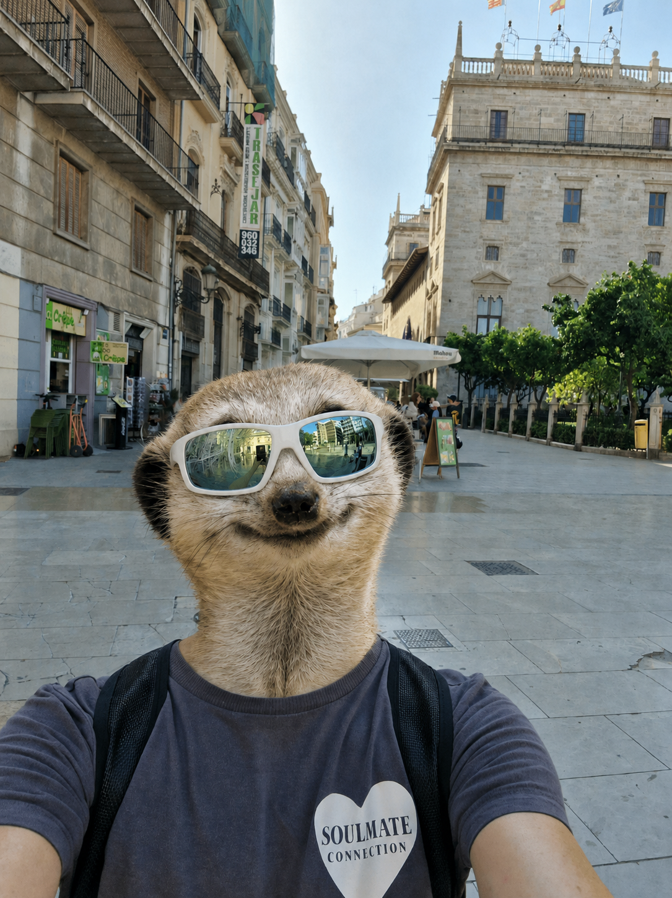

# Испания. Послевизовое легкомыслие

Когда я получила испанский ВНЖ по визе номада, подумала: ну все, жизнь удалась. И два месяца занималась чем угодно, только не обязанностями, которые появляются вместе с ВНЖ: испанским соцстрахом, регистрацией _autonomo_ и налогами.

Я переезжала, продавала машину и даже попала в ситуацию круче фильма «Терминал» на турецко-греческой границе. Обязательно расскажу, когда нас станет хотя бы 15. Планка невысокая, но надо же с чего-то начинать 🙂

Через два месяца я все-таки опомнилась и сделала то, что надо было сделать сразу. И очень вовремя. Сейчас, три года спустя, при продлении ВНЖ у меня не возникло проблем. А вот у людей, которые расслабились сильнее, вопросы от властей были. Иногда это заканчивалось большими расходами, иногда - невозможностью продлить ВНЖ.

К чему я это: многие получают одобрение и расслабляются так, будто выиграли чемпионат мира. Но одобрение ВНЖ - это только начало.

## Где обычно прилетает

- **Поздняя регистрация в испанском соцстрахе и как _autonomo_.** Это касается тех, кто работает по контракту. _Autonomo_ - испанский аналог ИП. Откладывать регистрацию точно не стоит: при продлении могут возникнуть вопросы.
- **ВНЖ используют как шенгенскую визу.** Если получить ВНЖ и жить в другой стране, к продлению или самому ВНЖ могут возникнуть серьезные вопросы.
- **Выезд до получения карточки ВНЖ.** Если карта еще не готова, нельзя просто улететь и потом спокойно вернуться. Сначала нужно оформить разрешение на возвращение, иначе можно застрять с необходимостью получать новую шенгенскую визу.
- **Паспорт на пляже.** Помню историю: номад пошел на барселонский пляж с паспортом, оставил рюкзак друзьям «на секундочку» и лишился документов. Не надо так.

Получение ВНЖ - не финиш, а старт. Расслабляться на этом моменте рано.

Когда можно будет расслабиться, расскажу в следующих постах. Если, конечно, нас станет хотя бы 15.

**Помогаю с номад-визой в Испанию.**

Сайт: https://ola-espanola.github.io/

Telegram: https://t.me/ola_espana
