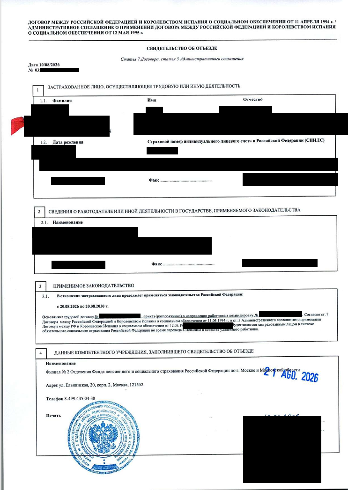
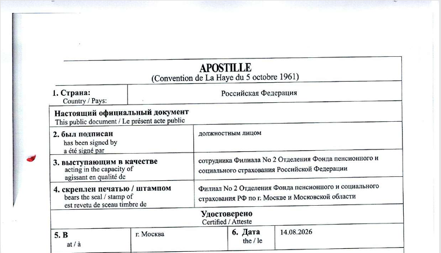
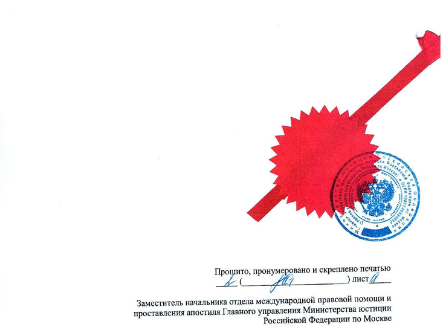

# Свидетельство СФР для ВНЖ цифрового кочевника в Испании

> Помощь в подаче документов на ВНЖ Испании: [ **t.me/ola_espana**](https://t.me/ola_espana)

Гайд по свидетельству СФР для ВНЖ цифрового кочевника в Испании. Для граждан России, которые подаются <mark style="background-color: #dff1ff; color: inherit; white-space: nowrap;">по найму</mark> у российского работодателя и сохраняют российское социальное страхование на время работы из Испании.

## Что это за документ

В России это **свидетельство об отъезде**, которое выдает Социальный фонд России (СФР). Оно подтверждает, что на указанный в нем период работы из Испании к работнику продолжает применяться российское законодательство о социальном обеспечении.

В требованиях UGE документ называется сертификатом применимого законодательства: *certificado de legislación aplicable*. Он позволяет сохранить российское соцстрахование вместо регистрации работника в испанской Seguridad Social.

Сведения о трудовой деятельности, выписка из лицевого счета СФР и справка об уплате взносов не заменяют это свидетельство.

## Требования к свидетельству

В свидетельстве должны быть указаны работник, российский работодатель и период, на который сохраняется российское социальное страхование. **UGE требует прямого указания, что покрытие распространяется на удаленную работу с территории Испании.** Одного упоминания трудового договора недостаточно, чтобы подтвердить это условие.

Смысл формулировки, которую нужно согласовать с СФР:

> На [ФИО] в период с [дата] по [дата] продолжает распространяться законодательство Российской Федерации о социальном обеспечении при выполнении удаленной работы с территории Испании.

Это пример формулировки, а не утвержденный бланк. Свидетельство оформляет и подписывает СФР.

Период покрытия запрашивайте на весь предполагаемый срок ВНЖ. По соглашению России и Испании период направления составляет до пяти лет с его начала; более длительный срок требует отдельного согласования между компетентными органами. Выдача нового свидетельства сама по себе не начинает новый пятилетний период.

Получите бумажный оригинал с подписью уполномоченного сотрудника и печатью СФР. Попросите гербовую печать: в практике подачи возникали претензии к печати «Для документов». Это практическая рекомендация, а не отдельное опубликованное требование UGE.

## Как оформляют на практике

На практике используют связку из трех документов: **приказ работодателя о командировке, свидетельство СФР и трудовой договор с условием об удаленной работе из Испании**. Условие об удаленной работе оформляют и отдельным дополнительным соглашением к договору.

1. **Работодатель оформляет приказ о командировке в Испанию.** В нем указывают сотрудника, место, даты и служебную цель направления. По этим датам запрашивают период покрытия в свидетельстве СФР. Цель формулируют с работодателем исходя из его задач. Приказ нужен СФР как основание для выдачи свидетельства.

2. **Удаленную работу закрепляют в трудовом договоре или дополнительном соглашении.** Если в основном договоре этого условия нет, в соглашении указывают дистанционный формат, возможность работать с территории Испании и период действия этих условий. Для UGE договор подают вместе с соглашением. Приказ о командировке сам по себе не подтверждает дистанционный формат работы.

3. **С приказом обращаются в клиентскую службу СФР.** Для обращения подготовьте заявление, паспорт РФ, загранпаспорт, СНИЛС, трудовой договор и приказ. Комплект составлен по практике получения; состав приложений к договору и дополнительные документы уточните в отделении. Запрашивайте свидетельство об отъезде по договору России и Испании от 11 апреля 1994 года: статья 7 договора и статья 3 административного соглашения от 12 мая 1995 года. Если сотрудник не знаком с документом, попросите передать вопрос специалисту по международным соглашениям.

4. **СФР оформляет свидетельство на указанный период.** Получить его можно лично или через представителя по доверенности; полномочия на подачу заявления и получение согласуйте с отделением. Ориентир по срокам - от дня приема готового комплекта до 3-4 недель. Срок своего обращения уточните в отделении.

Требования зависят от отделения СФР:

- **Удаленная работа в приказе и договоре.** Одни отделения требуют убрать упоминание удаленной работы из приказа, но принимают его в трудовом договоре. Другие возражают и против дистанционного трудового договора.
- **Замена приказа.** Отдельные отделения принимают вместо приказа дополнительное соглашение об удаленной работе с адресом в Испании или письмо работодателя с данными сотрудника и сроком работы.

До оформления документов согласуйте с отделением основание выдачи свидетельства и формулировки.

Приказ не заменяет письмо работодателя для UGE. В дозапросе UGE может потребовать и подтверждение, что направление в Испанию исходит от компании, а не только разрешение работнику работать откуда угодно.

## Если в свидетельстве нет слов об удаленной работе

На практике условия работы подтверждают совокупностью документов: свидетельством СФР, трудовым договором с дополнительным соглашением об удаленной работе и письмом работодателя. В пояснении связывают документы: кто работодатель, на какой период СФР подтверждает покрытие и где закреплена работа из Испании.

Есть одобрение после такого пояснения: по дозапросу заявительница представила прежнее свидетельство без упоминания командировки, договор с соглашением об удаленной работе и объяснение условий работы. Но из этого не следует, что соглашение всегда заменяет формулировку в свидетельстве. Найден и дозапрос, после которого пришлось уточнять текст самого свидетельства о покрытии удаленной работы из Испании.

Поэтому, если СФР выдал документ без нужной формулировки, подготовьте перечисленные подтверждения и пояснение. Возможность получить уточненное свидетельство проверьте до подачи: UGE вправе потребовать именно его, как указано в инструкции.

## Отмена приказа о командировке

Практика отмены приказа после получения свидетельства есть. В чате найдены рассказы от первого лица: работодатель оформил приказ, сотрудник получил свидетельство СФР, затем приказ отменили. Среди авторов есть участница, которая также сообщала об одобренном продлении ВНЖ.

Это подтверждает существование практики, но не ее последствия для соцстрахования. Отмена работодателем приказа и сохранение российского покрытия по международному договору - разные вопросы. Письменного подтверждения СФР, что после отмены основание покрытия сохраняется, не найдено. Этот вопрос нужно согласовать с СФР и работодателем до отмены приказа.

## Апостиль и перевод

Для подготовки пакета **рекомендуем апостиль на оригинал свидетельства и jurado перевод на испанский вместе с апостилем**.

По апостилю есть расхождение между нормой договора и практикой подачи: статья 18 освобождает документы, выданные для применения договора, от легализации. Однако в дозапросах UGE к этому свидетельству встречается прямое требование апостиля. Одобрения без него тоже есть. Поэтому апостиль здесь рекомендуется для снижения риска дозапроса, а не как безусловное требование двустороннего договора.

За апостилем на оригинал обращайтесь в территориальный орган Минюста в регионе выдачи свидетельства. До оплаты пошлины уточните, примут ли именно этот документ: сообщалось и об отказах в апостилировании. Нотариальная копия с апостилем не подтверждает подпись сотрудника СФР на оригинале и не равнозначна апостилю на оригинал.

После апостиля передайте свидетельство и апостиль присяжному переводчику, уполномоченному МИД Испании. Для загрузки подготовьте один PDF: свидетельство, апостиль и jurado перевод. В примере пакета по найму это `01_Certificado_cobertura_Seguridad_Social.pdf`.

## Медицинская страховка

Свидетельство СФР не дает права на медицинское обслуживание в государственной системе Испании. Для подачи нужна отдельная медицинская страховка с покрытием, соответствующим требованиям UGE.

## Пример свидетельства с апостилем

<figure style="max-width: 750px; margin: 24px auto;">
  
  <figcaption>Свидетельство СФР об отъезде.</figcaption>
</figure>

<figure style="max-width: 750px; margin: 24px auto;">
  
  <figcaption>Апостиль на свидетельстве.</figcaption>
</figure>

<figure style="max-width: 750px; margin: 24px auto;">
  
  <figcaption>Прошивка документа с печатью Минюста.</figcaption>
</figure>

<!-- PUBLIC_CONTENT_END -->

---

# Служебная часть: не публиковать

Все ниже этой отсечки хранится только в Markdown и не переносится на сайт, в том числе в HTML-комментарии.

Статус: 10 сентября 2026 года подготовлена локальная инструкция на основе утвержденного пользователем черновика от 9 сентября. Публичная часть синхронизирована с `docs/social-security-certificate.html`. Отправка в GitHub не выполнялась.

Иллюстрации предоставлены пользователем: `assets/images/SSocial/Svidetelstvo_ob_otyezde1.png`, `Svidetelstvo_ob_otyezde2.png`, `Svidetelstvo_ob_otyezde3.png`. Персональные данные заявителя закрыты в исходных изображениях; файлы не изменялись. На примере свидетельства есть указание удаленной работы из Испании, приказа работодателя и периода покрытия. Иллюстрации не подтверждают результат рассмотрения заявления UGE.

## Границы инструкции

- Основной вариант: гражданин РФ, трудовой договор с российским работодателем, сохранение российского соцстрахования при временной работе из Испании. Не распространять автоматически на любого сотрудника иностранной компании или на работу по контракту с последующей регистрацией autonomo.
- Правовой механизм основан на временном направлении работника. Нельзя представлять свидетельство как документ, который любой удаленный работник безусловно получит по заявлению.
- Испанские формы TA.300 и E/R.1(Cert.) из инструкции TGSS для направления работников в Россию относятся к обратному направлению: из Испании в Россию. В алгоритм получения российского свидетельства их не включать.
- В таблице `content/cuenta-ajena.md` сохранено «Апостиль + jurado перевод» и добавлена ссылка на эту инструкцию.

## Официальные источники

1. [Инструкция UGE для основного заявителя](https://ciudadaniaexterior.inclusion.gob.es/documents/d/unidadgrandesempresas/informacion-documentacion-pagina-web-titular-v2), проверена 09.09.2026. Страницы 4-5: варианты исполнения требований по социальному страхованию, готовый сертификат с прямым указанием покрытия удаленной работы из Испании, медицинское покрытие. Страница 6: перевод и общее требование легализации иностранных публичных документов. Нумерация здесь обычная, от первой страницы PDF, не индексы страниц с нуля.
2. [Договор России и Испании о социальном обеспечении и административное соглашение в BOE](https://www.boe.es/buscar/doc.php?id=BOE-A-1996-4208&lang=es). Договор: статьи 2-3 определяют охват, статьи 6-8 - применимое законодательство и исключения, статья 18 - освобождение документов от легализации. Административное соглашение: статья 3 - свидетельство по обращению работника или работодателя, предел в пять лет и отдельное согласование дальнейшего продления. Медицинская помощь в перечень покрытия договора не включена.
3. [Испанская Seguridad Social: временное направление работников в Россию](https://www.seg-social.es/wps/portal/wss/internet/InformacionUtil/32078/32253/1437/1440/119870?changeLanguage=es). Дополнительная проверка действующего механизма и срока; не источник российского порядка обращения.
4. [Минюст России: проставление апостиля](https://minjust.gov.ru/ru/pages/prostavlenie-apostilya/). Общий порядок обращения, территориальная компетенция, проверка подписи и печати, основания отказа. На странице указан размер пошлины 2500 рублей, но в основной текст стоимость не включена: перед публикацией суммы нужна отдельная проверка актуальной нормы НК РФ и региональных реквизитов.
5. [Минюст России: кто ставит апостиль на оригиналы](https://www.minjust.gov.ru/ru/appeals/faq/520/). Полномочия по официальным документам, в том числе документам, не отнесенным к другим перечисленным органам. Практика апостиля именно оригинала свидетельства СФР отдельно подтверждена сообщением от 03.08.2026 ниже.

На сайте СФР просмотрены разделы [международных договоров](https://sfr.gov.ru/grazhdanam/prozhivayushchim_za_rubezhom/~533) и [форм заявлений](https://sfr.gov.ru/grazhdanam/prozhivayushchim_za_rubezhom/~537). Общедоступная отдельная инструкция СФР по выдаче этого свидетельства для удаленной работы с единым комплектом документов и сроком услуги не найдена. Поэтому перечень для обращения в черновике обозначен как практический, а не как утвержденный регламент.

## Подтверждения из базы Telegram

Поиск начат с тематических материалов `Doc/Telegram/topics/`. Для деталей использованы `C:\Projects\Nomad\processed_nomad\clean_messages.jsonl` и исходные экспорты чатов. Ниже пути относительно `C:\Projects\Nomad`. Имена участников, документы с личными данными и изображения в репозиторий не переносились.

### Название и содержание свидетельства

- 12.06.2026, `Digital_nomad_Испания_2026-09-06/messages25.html#message54244`: образец ранее выданного свидетельства. На бланке заголовок «Свидетельство об отъезде», ссылки на договор 1994 года и административное соглашение 1995 года, разделы о работнике, работодателе, применимом законодательстве и выдавшем учреждении. Просмотрено изображение `photos/photo_413@12-06-2026_22-22-51.jpg`; сам документ датирован 2024 годом. Это не доказательство принятия конкретного образца UGE в 2026 году. Нельзя по этому изображению объявлять форму актуальной или рекомендовать печать «Для документов».
- 31.07.2026, `Чат_ВНЖ_Digital_Nomad_2026-09-06/messages191.html#message280170`: приложен фрагмент реального дозапроса UGE. Требуется сертификат органа соцстрахования страны работодателя, подтверждающий сохранение применимого законодательства, покрытие удаленной работы из Испании и срок. В самом изображении прямо требуются апостиль либо легализация и перевод уполномоченного jurado. Просмотрено `photos/photo_4039@31-07-2026_17-55-12.jpg`. Отдельно: автор сообщения предполагает, что проблема в апостиле; по одному фрагменту нельзя установить все причины дозапроса.

### Получение в СФР

- 03.08.2026, `Живу_в_Испании_Чат_2026-09-06/messages12.html#message13160`: подробный рассказ от первого лица о получении в Санкт-Петербурге на ул. Шевченко. После предварительного обращения заявитель принес письмо работодателя с подписью главного бухгалтера, собственное заявление, паспорт РФ, загранпаспорт и СНИЛС. Письмо согласовали вместо приказа о командировке. 23 июля свидетельство оформили во время приема, зарегистрировали обращение, поставили подпись и печать. Это подтверждает один согласованный вариант, а не обязанность всех отделений принимать письмо вместо приказа.
- 11.06.2026, `Чат_ВНЖ_Digital_Nomad_2026-09-06/messages186.html#message272668`: получение за неделю в Зеленограде, обращение по месту работы; потребовали приказ о командировке.
- 03.07.2025, `Чат_ВНЖ_Digital_Nomad_2026-09-06/messages162.html#message227221`: после отказов в двух районах Петербурга свидетельство выдали в Красногвардейском районе на следующий день. Для оформления сканировали трудовой договор, приказ о командировке, паспорт и СНИЛС; заявитель заполнил заявление. Не превращать этот рассказ в совет скрывать отказ или выбирать отделение для обхода требований.
- 29.04.2026, `Чат_ВНЖ_Digital_Nomad_2026-09-06/messages183.html#message267251`: получение через родителей по доверенности. Сопутствующее утверждение автора о невозможности оформить доверенность за пределами России не использовать: оно не подтверждено и не нужно для инструкции.

### Командировка и удаленная работа

- 02.09.2026, `Чат_ВНЖ_Digital_Nomad_2026-09-06/messages194.html#message284639`: рассказ от первого лица. СФР не принял приказ с указанием дистанционного выполнения обязанностей; после удаления этой формулировки из приказа свидетельство выдали. Из сообщения не следует, что итоговый документ отвечал актуальным требованиям UGE или привел к одобрению.
- 30.01.2026, `Чат_ВНЖ_Digital_Nomad_2026-09-06/messages177.html#message256636`: сообщение об отказах московских отделений при дистанционном трудовом договоре, в том числе с приказом о командировке, и направлении вопроса на дополнительное рассмотрение.
- 04.02.2026, `Живу_в_Испании_Чат_2026-09-06/messages6.html#message6588`: после подачи нового свидетельства с приказом о командировке в основаниях UGE запросила подтверждение, что заявитель едет для удаленной работы, а не в рабочую поездку. В ответ приложили прежнее свидетельство без упоминания командировки, трудовой договор с дополнением об удаленной работе и пояснение. Затем сообщено об одобрении продления. Текст самого дозапроса к сообщению не приложен; точную позицию инспектора восстанавливать только по пересказу нельзя. Этот пример дополнительно показывает, что получение свидетельства в СФР не гарантирует достаточности его формулировок для UGE.
- Вывод исследования: требование UGE к удаленной работе установлено официально; единой подтвержденной процедуры СФР, которая гарантированно согласует его с основанием временного направления работника, не найдено. Нельзя обещать решение одной универсальной фразой в заявлении.
- После дополнительного поиска найдены не только советы, но и рассказы от первого лица об отмене приказа. Практика описана в основном тексте; сохранение основания покрытия после отмены не представлено как доказанный факт. Подробные ссылки и пределы доказательности приведены ниже.

## Дополнительное исследование практики от 09.09.2026

Проверены связанные сообщения и продолжение историй, а не только отдельные совпадения по ключевым словам. Для связи сообщений использовано совпадение автора внутри одного чата. Само по себе такое совпадение не доказывает, что все сообщения относятся к одному и тому же комплекту документов; ниже это отмечено там, где влияет на вывод.

### Приказ, отдельное соглашение и отмена: прямые рассказы

- 07.08.2025, `Digital_nomad_Испания_2026-09-06/messages20.html#message43648`: заявительница в Екатеринбурге описывает последовательность от первого лица: получила приказ о командировке, после отказа одного отделения получила свидетельство в другом и отменила приказ. Упоминание решения UGE в этом сообщении отсутствует; связанного отчета этой участницы об одобрении не найдено. Подтверждение получения документа и отмены приказа, не подтверждение результата миграционной процедуры.
- 12.01.2026, `Закрытый_чат_Продление_2026-09-06/messages2.html#message2869`: участница описывает получение нового свидетельства в Москве. Вначале ее направляли между отделениями по месту проживания и регистрации работодателя. После письменного обращения в главное отделение документы приняли в Отрадном. Оформление заняло 3-4 недели. В ответе `#message2872` подтверждает, что СФР запрашивал и приказ, и договор. Официальный ответ главного отделения в сообщении не приложен: правило о возможности обращения в любое отделение как установленную норму не публиковать.
- 13.01.2026, тот же чат и файл, `#message2882`: та же участница прямо сообщает, что приказ ей сделали и потом отменили. `#message2883`: удаленная работа была закреплена в дополнительном соглашении, в основном договоре этого условия не было. `#message2888`: свидетельство приняли без апостиля. Это прямое описание личной практики, не только чужой совет.
- У этой же участницы есть сообщения о продлении в сентябре 2025 года: `Закрытый_чат_Продление_2026-09-06/messages2.html#message2019` от 25.09.2025 и `#message2099` от 26.09.2025. Однако точная дата отмены приказа и полный комплект поданного заявления не опубликованы. Корректный вывод: автор с одобренным продлением описывает отмену приказа и отдельное соглашение. Некорректный вывод: доказано, что UGE проверила отмену и признала сохранение покрытия.
- 13.01.2026, `#message2884` того же чата: утверждение участницы, что свидетельство не отзывают после отмены приказа. Это ее мнение, не ответ СФР и не правило действительности свидетельства. В основной текст как гарантия не перенесено.

### Разделение приказа и условия об удаленной работе

- 02.09.2026, `Чат_ВНЖ_Digital_Nomad_2026-09-06/messages194.html#message284620`: автор прямо говорит, что дистанционная работа через интернет оставалась в трудовом договоре; для получения свидетельства переделали именно приказ, убрав из него упоминание удаленной работы. Сообщение `#message284639` описывает формулировку приказа подробнее. Поэтому писать «СФР всегда требует убрать удаленную работу из трудового договора» нельзя.
- 02.09.2026, там же `#message284621`: другой участник сообщает, что на Тульской ему, напротив, сказали убрать дистанционную работу именно из договора. Это разные требования отделений, а не единое правило.
- 20.01.2026, `Закрытый_чат_Продление_2026-09-06/messages3.html#message3163`, `#message3164`, `#message3165`, `#message3166`: заявитель описывает подачу в СФР с адресом работы в Испании в проекте свидетельства; дистанционная работа закреплена в отдельном соглашении, которое он не предъявлял СФР. На момент этих сообщений свидетельство еще не выдано. Нельзя считать эту переписку самостоятельным доказательством успешного оформления или советовать скрывать запрошенные СФР изменения к договору.
- Продолжение истории этого автора: `Закрытый_чат_Продление_2026-09-06/messages5.html#message5969` от 11.05.2026 содержит отказ в продлении из-за смены юридического лица работодателя. Это не отказ из-за отдельного соглашения или свидетельства. Не смешивать причины решений с обсуждаемой практикой разделения документов.
- 13.06.2026, `Digital_nomad_Испания_2026-09-06/messages25.html#message54256`: совет показывать UGE соглашение, а СФР не показывать. Это совет без личного результата; не использовать как доказательство, что такое действие допустимо при запросе СФР полного договора.

### Получение без приказа и ответ на дозапрос

- 08.12.2025, `Чат_ВНЖ_Digital_Nomad_2026-09-06/messages172.html#message249736`: свидетельство в Одинцове получили за пять дней на основании дополнительного соглашения об удаленной работе с адресом в Испании. После возражений принимающих сотрудников документы согласовал начальник отделения. Это полноценная практическая альтернатива приказу в конкретном обращении, не только предположение.
- 04.02.2026, `Живу_в_Испании_Чат_2026-09-06/messages6.html#message6588`: тот же отображаемый автор описывает уже одобрение продления после дозапроса. Сначала подавали новое свидетельство с упоминанием приказа о командировке; после требования подтвердить удаленную работу приложили прежнее свидетельство без командировки, договор с соглашением об удаленной работе и пояснение. Совпадение автора между разными чатами само по себе слабее, чем связь внутри одного чата; основные выводы о получении и одобрении можно подтвердить каждым рассказом отдельно.
- 17.02.2026, `Закрытый_чат_Продление_2026-09-06/messages3.html#message3493`: автор этой истории дополнительно поясняет, что UGE попросила свидетельство без приказа о командировке и обоснование удаленной работы; прежнее свидетельство было без апостиля. `#message3496` уточняет: на старое свидетельство отказались принимать документы для апостиля в подмосковном МФЦ, новое позднее передали в Минюст через посредника. Не превращать это в утверждение, что именно Минюст лично отказал по старому документу.
- 03.08.2026, `Живу_в_Испании_Чат_2026-09-06/messages12.html#message13160`: ранее сохраненный подробный пример Санкт-Петербурга, где вместо приказа согласовали письмо работодателя. Поддерживает альтернативный способ получения, но не отменяет требований иных отделений.

### Где отдельного соглашения или общих слов недостаточно

- 20.01.2026, `Закрытый_чат_Продление_2026-09-06/messages3.html#message3160`: заявительница цитирует требование UGE, чтобы именно сертификат подтверждал покрытие удаленной работы и направления на территорию Испании. В ее свидетельстве уже была ссылка на договор с возможностью дистанционной работы, но этого инспектору не хватило. Перевод сообщения «поездки в пределах Испании» неточен: в оригинале говорится о направлении на территорию Испании.
- 27.01.2026, `Чат_ВНЖ_Digital_Nomad_2026-09-06/messages177.html#message256175`: автор сообщает об одобрении после уточнения формулировки. В ответе `#message256199` на вопрос `#message256198` указывает, что в разделе 3 свидетельства должна ясно звучать удаленная работа с территории Испании. Полного исправленного свидетельства и порядка его переоформления в этих сообщениях нет; нельзя советовать заявителю самому изменять выданный документ.
- 15.12.2025, `Чат_ВНЖ_Digital_Nomad_2026-09-06/messages173.html#message250685`: цитируется другой дозапрос UGE. Для применения соглашения требуют подтвердить направление по решению компании для ее организационных или стратегических нужд, а не просто разрешение работать удаленно. Перевод автора «передача полномочий» неточен. Приложенное изображение `photos/photo_3631@15-12-2025_12-14-17.jpg` просмотрено: это фрагмент свидетельства СФР с формулировкой про дистанционную работу, не изображение самого дозапроса. Не переносить в репозиторий: содержит личные данные.
- Вывод: отдельное соглашение подтверждает условия труда, но не является документом СФР о применимом законодательстве. Пояснение и согласованный комплект документов реально использовали при ответе на дозапрос; официального универсального разрешения заменить ими требуемую формулировку свидетельства не найдено.

### Отмена приказа: что подтверждено и чего не установили

- Прямые рассказы: Екатеринбург, 07.08.2025, `#message43648`; участница московской истории, 13.01.2026, `#message2882`, см. полные пути выше.
- Описание распространенной практики без собственного подтвержденного результата: `Чат_ВНЖ_Digital_Nomad_2026-09-06/messages190.html#message278416` от 21.07.2026; `Закрытый_чат_Продление_2026-09-06/messages9.html#message9826` от 22.07.2026; `Чат_ВНЖ_Digital_Nomad_2026-09-06/messages193.html#message282214` от 17.08.2026 и `#message282926` от 20.08.2026.
- В этих обсуждениях отмену связывают с нежеланием работодателя оформлять длительную командировку и связанные выплаты. Сопутствующие категоричные утверждения о налоговых ставках и об отсутствии любых последствий не проверены и не включены в инструкцию.
- В чате есть и возражение о риске потери основания покрытия: `Чат_ВНЖ_Digital_Nomad_2026-09-06/messages183.html#message267345` от 30.04.2026. Это мнение участника, не решение органа. Правовую рамку определяют статьи 6-7 договора России и Испании и статья 3 административного соглашения; отдельного официального ответа о последствиях отмены приказа не найдено.
- Не найден подтвержденный результат проверки, при которой UGE или СФР знали об отмене приказа, рассмотрели ее последствия и письменно подтвердили сохранение покрытия. Не найден и доказанный отказ именно по этой причине. Нельзя ни обещать отсутствие последствий, ни выдавать предположение об автоматическом аннулировании за установленный факт.

### Печать

- 08.07.2026, `Чат_ВНЖ_Digital_Nomad_2026-09-06/messages189.html#message276692`: автор сообщает об отказе с мотивировкой об отсутствии печати, хотя на свидетельстве стояла печать «Для документов». После повторной подачи со свидетельством с гербовой печатью получено одобрение. Одновременно обновляли и другие документы. Поэтому нельзя доказать, что единственной причиной была разновидность печати, или объявить гербовую печать отдельным обязательным требованием UGE. В черновике это именно рекомендация.

### Апостиль

- 03.08.2026, `Живу_в_Испании_Чат_2026-09-06/messages12.html#message13160`: оригинал свидетельства приняли на апостиль в Минюсте Санкт-Петербурга, на ул. Оптиков. Сотрудник проверил наличие образца подписи выдавшего свидетельство работника СФР и назначил выдачу на третий рабочий день. В сообщении есть несогласованная дата получения «28.08.26», более поздняя, чем дата публикации и июльская последовательность событий. Ее не исправляли догадкой и не использовали для расчета фактического срока.
- 04.02.2026, `Живу_в_Испании_Чат_2026-09-06/messages6.html#message6588`: по словам автора, на прежнее свидетельство отказались ставить апостиль, ссылаясь на отсутствие такого требования. Новое свидетельство с приказом о командировке в основаниях апостилировали через посредника за пять дней; способ решения вопроса автору неизвестен. Письменного отказа нет, поэтому нельзя устанавливать его точное правовое основание или предлагать этот путь как воспроизводимый алгоритм. Дальнейший дозапрос UGE был связан с характером работы, см. выше.
- 31.07.2026, `Чат_ВНЖ_Digital_Nomad_2026-09-06/messages191.html#message280170`: прямой текст требования апостиля в приложенном дозапросе, см. выше.
- 04.09.2026, `Чат_ВНЖ_Digital_Nomad_2026-09-06/messages195.html#message284948`: продление, подача 7 августа, одобрение 3 сентября без дозапросов; свидетельство СФР было без апостиля. Это актуальный пример принятия, но не обещание для всех заявлений.
- 24.02.2026, `Живу_в_Испании_Чат_2026-09-06/messages6.html#message7282`: консультант пишет, что апостиль не нужен, но дозапросы встречались. Это позиция автора, не опубликованное разъяснение UGE; она не заменяет норму договора и текст фактического дозапроса.

## Что требует уточнения

1. **Письменная позиция СФР о дистанционной работе из Испании.** Нужен актуальный ответ компетентного подразделения: основание выдачи, принимаемый документ работодателя, возможность прямо указать покрытие удаленной работы. Найденные успешные обращения не устраняют противоречие между практикой отделений.
2. **Применение освобождения от апостиля в миграционной процедуре.** Статья 18 относится к документам для применения договора; UGE рассматривает заявление на ВНЖ и запрашивает апостиль. Публичного адресного разъяснения UGE именно о российском свидетельстве и статье 18 не найдено. До его получения не писать ни «апостиль всегда обязателен по договору», ни «UGE не вправе его просить».
3. **Отказ Минюста в апостилировании.** Общие основания отказа существуют, но причины отказов именно по свидетельствам из сообщений надо устанавливать по письменным ответам. Не предлагать нотариальную копию как гарантированный обход.
4. **Давность выдачи и продление ВНЖ.** Не найдено официального общего правила «свидетельство не старше месяца» или «не старше трех месяцев». Не вводить такой срок. Отдельно проверить, когда для продления достаточно ранее выданного свидетельства с продолжающимся покрытием и когда нужен новый документ, особенно при окончании пятилетнего периода.
5. **Гербовая печать.** Официального требования UGE именно к гербу на печати не найдено. Практическая рекомендация имеет ограниченную доказательную базу, описанную выше.
6. **Деньги, сроки и адреса.** Единую стоимость услуги СФР и нормативный срок выдачи свидетельства не установили. Не обещать бесплатность, один день или неделю как обязательный стандарт. Адреса из чата сохранены как ориентиры для проверки, не как проверенные актуальные контакты для сайта.
7. **Отмена приказа после выдачи свидетельства.** Практика подтверждена личными рассказами. Не установлено, сохраняется ли в конкретной ситуации основание применения российского законодательства после отмены, нужно ли уведомлять СФР и требуется ли переоформление свидетельства. Нужен письменный ответ СФР по фактическим условиям работы, а не только подтверждение, что работодатель может отменить свой приказ.

## Альтернатива при невозможности получить свидетельство

По инструкции UGE иностранный работодатель может зарегистрироваться в испанской Seguridad Social без рабочего подразделения в Испании и обязаться зарегистрировать сотрудника в общем режиме после одобрения, до начала работы. Это отдельная процедура с участием работодателя, не замена свидетельства справкой об уплате российских взносов и не регистрация наемного сотрудника как autonomo. При необходимости готовить отдельную инструкцию после согласования с пользователем.
