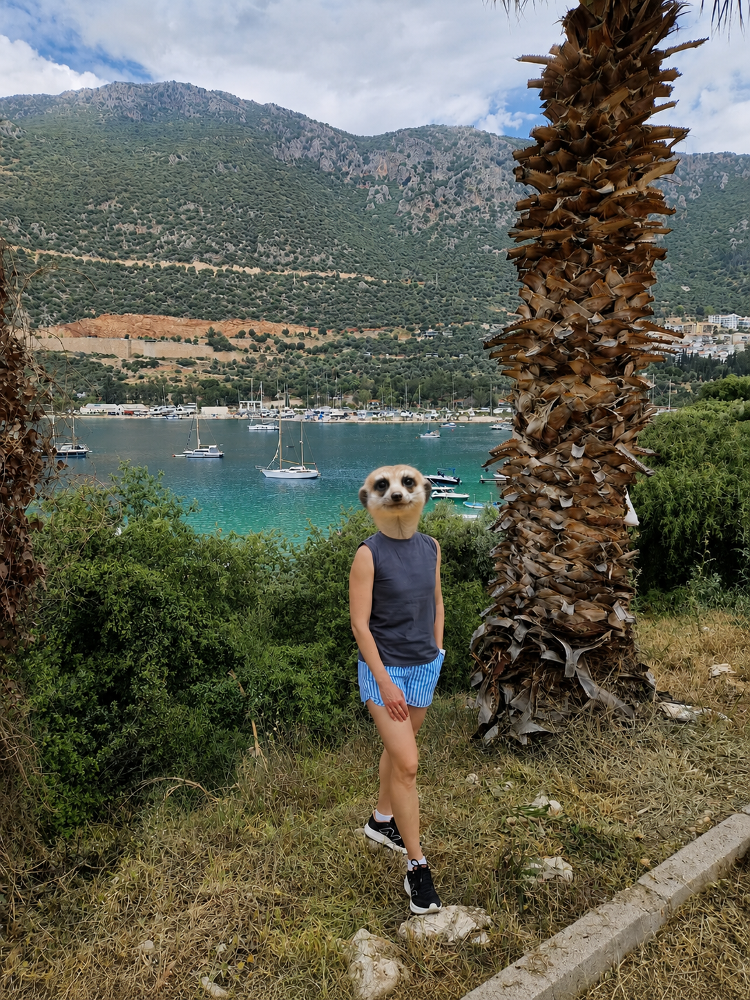

# Стоит ли ехать в Испанию по визе номада

Краткий ответ: если деньги есть, то стоит. А если денег нет, лучше сидеть дома.

Если серьезно: когда доход впритык, вы его завышаете в анкете или переезжаете вообще без запаса, Испания может оказаться не самым комфортным местом для старта. Жилье дорогое, налоги платить придется. Поэтому перед переездом лучше честно посчитать деньги, а не надеяться, что «как-нибудь получится».

Давайте сравним мои две любимые страны: Турцию и Испанию.

В любой стране больше всего денег обычно уходит на жилье и налоги. Если вы не русский клепто-олигарх, конечно.

С Турцией у меня связана смешная история. После ковида я жила там по туристическому ВНЖ и работала удаленно на российскую компанию. Как законопослушный человек, я задумалась: раз живу в Турции большую часть года, наверное, надо разобраться с налогами.

Я не поняла, как сделать это правильно, и написала в налоговую. Ответ был примерно такой: «Девочка, ты работаешь на иностранную компанию, вот и работай. Не надо нас грузить такими мелочами».

Турция вообще умеет быть очень удобной. Заносишь кэш в банк, и никто не устраивает допрос: «Откуда деньги?» После Европы это вызывает отдельную благодарность к стране. И в целом жить там можно заметно дешевле, несмотря на значительное повышение цен за последние 3-4 года.

Но в итоге я выбрала Европу и Испанию. Здесь жилье дороже, налоги платить надо, зато мне здесь лучше. И я ни разу не пожалела, хотя Турцию очень люблю.

До первой поездки я думала, что Турция - это что-то вроде Египта: море, отели и немного хаоса. Но она приятно удивила. Там хороший сервис, обалденная природа и гораздо больше разнообразия, чем я ожидала. Турция точно не сводится к all inclusive.

Про плюсы Испании расскажу отдельно.

А пока вывод простой: если денег впритык, рассмотрите Турцию. Вопрос получения ВНЖ в Турции в этой статье не рассматриваю. А если есть финансовый запас и вам ближе Европа - едем в Испанию.

**Помогаю с номад-визой в Испанию.**

Сайт: https://ola-espanola.github.io/

Telegram: https://t.me/ola_espana
