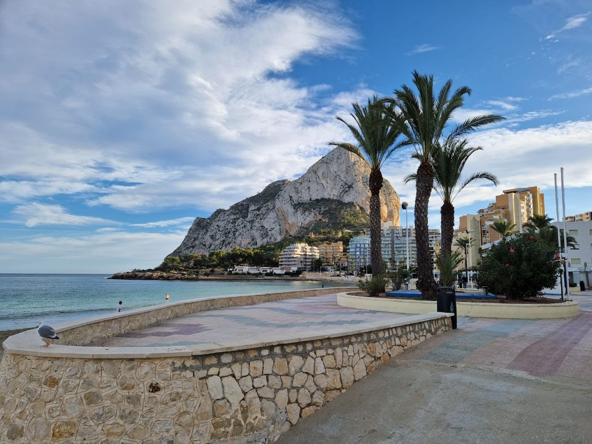

# Знакомство. Виза цифрового кочевника в Испанию

Привет! Я Оля. Живу в Испании четвертый год, работаю в IT и помогаю тем, кто готовит документы на визу цифрового кочевника.

В этом блоге буду разбирать подачу спокойно и по делу: кому подходит этот ВНЖ, какие документы действительно нужны и где обычно возникают сложности.

## Кому подходит виза номада

Для граждан России это один из рабочих способов переехать в Испанию, если уже есть стабильная удаленная работа. Визу дают не под идею переезда, а под реальную работу, доход и понятные отношения с работодателем или клиентами.

### Доход

В 2026 году для одного человека нужен доход от 2 849 EUR в месяц до налогов. Для пары - от 3 917 EUR в месяц. Сумма считается из испанского SMI при 12 выплатах в год: заявитель подтверждает 200% SMI, партнер - еще 75% SMI.

Доход подтверждают не только договором: нужны зарплатные листы или счета за последние три месяца и банковская выписка с этими поступлениями.

### Работа в найме

Подходит сотруднику российской или другой иностранной компании. Компания должна реально работать не меньше года, а трудовые отношения с вами - идти не меньше трех месяцев. Нужны трудовой договор, подтверждение дохода и письмо компании о том, что работать из Испании можно.

### Работа по контракту

Подходит тем, кто оказывает услуги иностранным клиентам по договорам. Нужны договоры, счета и поступления за последние три месяца. Если есть испанские клиенты, их доля не должна превышать 20% всей работы.

### Еще несколько условий

Нужно подтвердить профильное образование или минимум три года опыта, оформить медицинское и социальное покрытие и показать отсутствие судимости по требованиям процедуры. Во всех вариантах работа должна действительно выполняться удаленно.

Подробный разбор: [Кому подходит ВНЖ](../docs/eligibility.html).

## Это не шенген

ВНЖ номада - не туристический шенген на три года. Он выдается для жизни и удаленной работы в Испании. После переезда важно сохранять заявленную работу, платить налоги в Испании и подавать обязательные декларации.

Если работа прекращается, доход падает или налоги не платят, это может повлиять на продление. При серьезных нарушениях уже выданный ВНЖ могут отозвать.

## О документах и «стратегиях»

Раньше некоторые конторы предлагали «нарисовать» документы и рекламировали ВНЖ номада как шенгенскую визу на три года. Это не так. UGE - государственное подразделение Испании, которое рассматривает такие заявления, - сейчас намного строже проверяет подлинность документов и реальные основания для ВНЖ.

UGE может запросить дополнительные подтверждения или оригиналы. Если документы поддельные либо заявленные условия не существуют, могут отказать, не продлить разрешение или отозвать уже выданный ВНЖ. За такие схемы UGE теперь берется всерьез.

Неважно, платите вы 2 000 EUR за сопровождение или собираете пакет сами: договоры, справки, банковские выписки и объяснение своего дохода все равно готовит заявитель. Специалист может помочь с порядком и проверкой, но не создаст за вас реальную работу и историю дохода. Не стоит платить большие деньги за рекламу в духе «все сделаем за вас» или «разработаем стратегию без вашего участия».

Я постепенно собираю гид для тех, кто хочет переехать в Испанию по визе номада: https://ola-espanola.github.io/. Буду пополнять его статьями, списками документов и обновлениями по практике подачи. Всем привет и до встречи в следующих постах!

Подробные материалы и списки документов: https://ola-espanola.github.io/blog/

Telegram-канал: https://t.me/ola_espana
